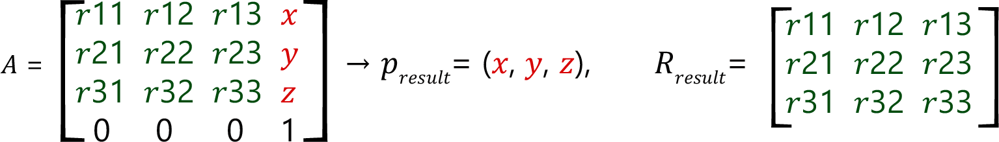

# FC\_PoseMatrixToPositionRotationMatrix

## Overview

|  |  |
| --- | --- |
| Type: | Function |
| Available as of: | V1.1.0.0 |

## Description

Given a pose matrix, the function returns a 3D vector and a 3D matrix representing the translational and the rotational parts of the input pose.

## Interface

| Input | Data type | Description |
| --- | --- | --- |
| i\_stPoseMatrix | [ST\_Matrix4D](ST_Matrix4D-GeneralInformation-0C050CBD.html#ST_Matrix4D-GeneralInformation-0C050CBD) | A pose matrix. |

| Output | Data type | Description |
| --- | --- | --- |
| q\_xError | BOOL | If this output is set to TRUE, an error has been detected. For details, refer to q\_etResult and q\_etResultMsg. |
| q\_etResult | [ET\_Result](ET_Result-GeneralInformation-0C182C26.html#ET_Result-GeneralInformation-0C182C26) | Provides diagnostic and status information as a numeric value. |
| q\_sResultMsg | STRING[80] | Provides additional diagnostic and status information as a text message. |
| q\_stPosition | [ST\_Vector3D](ST_Vector3D-GeneralInformation-0FB413FF.html#ST_Vector3D-GeneralInformation-0FB413FF) | A 3D vector. |
| q\_stRotationMatrix | [ST\_Matrix3D](ST_Matrix3D-GeneralInformation-0C04E9BF.html#ST_Matrix3D-GeneralInformation-0C04E9BF) | A 3D rotation matrix. |

## Diagnostic Messages

| q\_xError | q\_etResult | Enumeration value | Description |
| --- | --- | --- | --- |
| FALSE | Ok | 0 | Success |

## Ok

|  |  |
| --- | --- |
| Enumeration name: | Ok |
| Enumeration value: | 0 |
| Description: | Success |

EIO0000002815.02