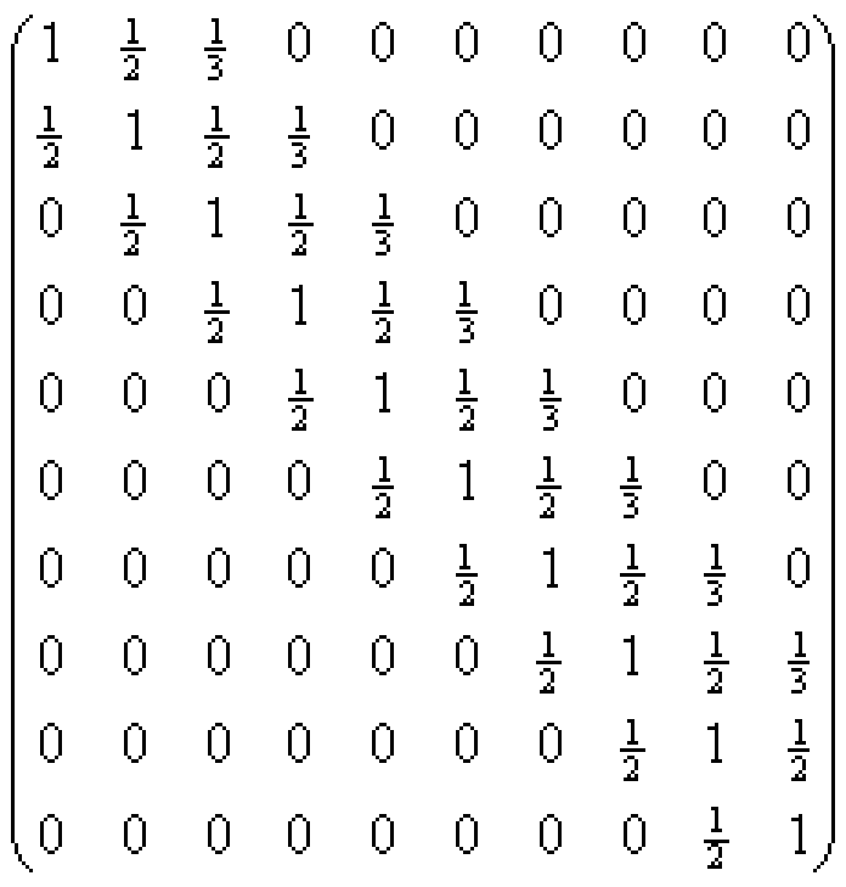
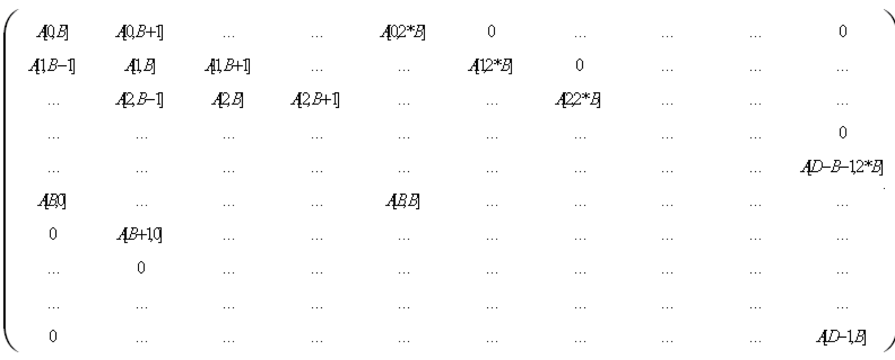

# FC\_SolveLinearSystemBandAlgorithm

## Overview

|  |  |
| --- | --- |
| Type: | Function |
| Available as of: | V1.1.0.0 |

## Description

This function solves the equation system that is specified by a band algorithm. A band matrix is a matrix that only contains the main diagonal and some secondary diagonals of non-zero elements. Systems of equations with band matrices are frequently encountered in practice (e.g. when calculating splines). They are often very large (>1000 unknowns), so storing the associated matrix in a square array would be an enormous waste of memory (in a 1000 x 1000 matrix for a spline, only 3000 of the 1000000 matrix elements would be different from zero). Instead, the matrix is stored in an array that has as many rows as the matrix, but only a few columns, and the Gaussian algorithm is adapted accordingly.



## Interface

| Input | Data type | Description |
| --- | --- | --- |
| i\_diDim | DINT | Number of equations of the solving system or lines / columns of the corresponding matrix. Must be greater than or equal to 2. |
| i\_diBands | DINT | Number of bands of the equation system. The bands are the secondary diagonals that the uneven zero elements receive where counting is carried out on the main diagonal that contains several of those diagonals. For example, the matrix above has two bands. |

| Input/Output | Data type | Description |
| --- | --- | --- |
| iq\_alrMatrix | ARRAY[\*, \*] OF LREAL | Two-dimensional array where the matrix of the linear equation system is stored.  The size of the first dimension must be at least i\_diDim.  The size of the second dimension must be at least 3 \* i\_diBands + 1. |
| iq\_alrVector | ARRAY[\*] OF LREAL | Array where the non-homogeneous vector ("right side") of the linear equation system is stored.  The size of the array must be at least i\_diDim. |
| iq\_alrSolutionVector | ARRAY[\*] OF LREAL | Array where the solution vector of the linear equation system is stored.  The size of the array must be at least i\_diDim.  The POU calculates the vector SolutionVector so that the equation matrix \* SolutionVector = Vector is fulfilled. |

| Output | Data type | Description |
| --- | --- | --- |
| q\_xError | BOOL | If this output is set to TRUE, an error has been detected. For details, refer to q\_etResult and q\_etResultMsg. |
| q\_etResult | [ET\_Result](ET_Result-GeneralInformation-0C182C26.html#ET_Result-GeneralInformation-0C182C26) | Provides diagnostic and status information as a numeric value. |
| q\_sResultMsg | STRING[80] | Provides additional diagnostic and status information as a text message. |

## Notes

* This function requires additional memory for internal calculations. This memory is temporarily allocated when the function is executed.

  Size: i\_diDim \* (3 \* i\_diBands + 2) \* SIZEOF(LREAL) in bytes.
* The correct dimensions of the arrays assigned to the corresponding IN\_OUTs must be verified. Otherwise, the function detects memory access errors.

  iq\_alrMatrix: 3 \* i\_diBands + 1 LREALs per dimension (i\_dim)

  iq\_alrVector: i\_diDim LREALs

  iq\_alrSolutionVector: i\_diDim LREALs
* The assignment of the matrix elements to the elements of the array A is as follows (D = i\_diDim, B = i\_diBands has been set for a shorter notation):

Assignment of the elements of a band matrix to the elements of the array of the band matrix POU



Visualization using the band matrix above as an example.

```
VAR
	diDim      : DINT                 := 10;
	diBands    : DINT                 := 2;
	diCols     : DINT                 := 7;
	alrA       : ARRAY[0..9, 0..6] OF LREAL;
	alrB       : ARRAY[0..9] OF LREAL := [10 (2.0)]; // Example for 'right side'
	alrX       : ARRAY[0..9] OF LREAL;
	xError     : BOOL;
	etResult   : SE_MATH.ET_Result;
	sResultMsg : STRING(80);
	diRows     : DINT;
	diColumns  : DINT;
END_VAR

// Assignment of the matrix
FOR diRows := 0 TO (diDim - 1) DO
	FOR diColumns := 0 TO (3 * diBands) DO
		alrA[diRows, diColumns] := 0.0;
	END_FOR
END_FOR
FOR diRows := 0 TO (diDim - 1) DO
	alrA[diRows, diBands] := 1.0;
END_FOR
FOR diRows := 1 TO (diDim - 1) DO
	alrA[diRows, diBands - 1] := 0.5;
END_FOR
FOR diRows := 0 TO (diDim - 2) DO
	alrA[diRows, diBands + 1] := 0.5;
END_FOR
FOR diRows := 0 TO (diDim - 3) DO
	alrA[diRows, diBands + 2] := 1.0 / 3.0;
END_FOR

// Function call-up
SE_MATH.FC_SolveLinearSystemBandAlgorithm(
	i_diDim              := diDim,
	i_diBands            := diBands,
	iq_alrMatrix         := alrA,
	iq_alrVector         := alrB,
	iq_alrSolutionVector := alrX,
	q_xError             => xError,
	q_etResult           => etResult,
	q_sResultMsg         => sResultMsg
);
```

After calling up the function, the solution of the equation system is available in array alrX.

## Diagnostic Messages

| q\_xError | q\_etResult | Enumeration value | Description |
| --- | --- | --- | --- |
| FALSE | Ok | 0 | Success |
| TRUE | DynIecDataSizeTooSmall | 75 | There is not enough dynamic memory reserved. |
| TRUE | InvalidInputValue | 324 | At least one of the given input parameters is invalid. Detailed information is provided by the output q\_sResultMsg of the associated POU. |
| TRUE | MatrixSingular | 77 | The matrix is singular. |
| TRUE | UnexpectedFeedback | 1 | An error was detected during execution. |

## DynIecDataSizeTooSmall

|  |  |
| --- | --- |
| Enumeration name: | DynIecDataSizeTooSmall |
| Enumeration value: | 75 |
| Description: | There is not enough dynamic memory reserved. |

| Cause | Solution |
| --- | --- |
| There is no or not enough dynamic memory available. | Increase the available dynamic memory Controller > Configuration > Program > DynIECDataSize. |

## InvalidInputValue

|  |  |
| --- | --- |
| Enumeration name: | InvalidInputValue |
| Enumeration value: | 324 |
| Description: | At least one of the given input parameters is invalid. Detailed information is provided by the output q\_sResultMsg of the associated POU. |

| Cause | Solution |
| --- | --- |
| The value at the input i\_diDim is invalid. | The value at the input i\_diDim must be greater than 1. |
| The value at the input i\_diBands is invalid. | The value at the input i\_diBands must be greater than 0. |
| The size of the first dimension of iq\_alrMatrix is lower than the value of the input i\_diDim. | Verify the size of iq\_alrMatrix and the value of i\_diDim. |
| The size of the second dimension of iq\_alrMatrix is lower than the value of the input 3 \* i\_diBands + 1. | Verify the size of iq\_alrMatrix and the value of i\_diBands. |
| The size of iq\_alrVector is lower than the value of the input i\_diDim. | Verify the size of iq\_alrVector and the value of i\_diDim. |
| The size of iq\_alrSolutionVector is lower than the value of the input i\_diDim. | Verify the size of iq\_alrSolutionVector and the value of i\_diDim. |

## MatrixSingular

|  |  |
| --- | --- |
| Enumeration name: | MatrixSingular |
| Enumeration value: | 77 |
| Description: | The matrix is singular. |

| Cause | Solution |
| --- | --- |
| The matrix at the input i\_plrMatrix is singular. | Set the input i\_plrMatrix to a regular matrix. |

## Ok

|  |  |
| --- | --- |
| Enumeration name: | Ok |
| Enumeration value: | 0 |
| Description: | Success |

The equation system has been successfully solved.

## UnexpectedFeedback

|  |  |
| --- | --- |
| Enumeration name: | UnexpectedFeedback |
| Enumeration value: | 1 |
| Description: | An error was detected during execution. |

| Cause | Solution |
| --- | --- |
| Error detected in the execution. | Contact your Schneider Electric service representative. |

EIO0000002815.02