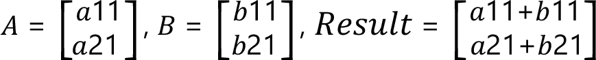

# FC\_Vector2DAddition

## Overview

|  |  |
| --- | --- |
| Type: | Function |
| Available as of: | V1.1.0.0 |

## Description

Given two 2D input vectors, the function returns the element-wise addition of their elements.

## Interface

| Input | Data type | Description |
| --- | --- | --- |
| i\_stVectorA | [ST\_Vector2D](ST_Vector2D-GeneralInformation-0BFF6B0C.html#ST_Vector2D-GeneralInformation-0BFF6B0C) | First 2D vector to be added. |
| i\_stVectorB | [ST\_Vector2D](ST_Vector2D-GeneralInformation-0BFF6B0C.html#ST_Vector2D-GeneralInformation-0BFF6B0C) | Second 2D vector to be added. |

| Output | Data type | Description |
| --- | --- | --- |
| q\_xError | BOOL | If this output is set to TRUE, an error has been detected. For details, refer to q\_etResult and q\_etResultMsg. |
| q\_etResult | [ET\_Result](ET_Result-GeneralInformation-0C182C26.html#ET_Result-GeneralInformation-0C182C26) | Provides diagnostic and status information as a numeric value. |
| q\_sResultMsg | STRING[80] | Provides additional diagnostic and status information as a text message. |

## Return Value

| Data type | Description |
| --- | --- |
| [ST\_Vector2D](ST_Vector2D-GeneralInformation-0BFF6B0C.html#ST_Vector2D-GeneralInformation-0BFF6B0C) | The function returns the element-wise addition of the elements of two 2D input vectors. |

## Diagnostic Messages

| q\_xError | q\_etResult | Enumeration value | Description |
| --- | --- | --- | --- |
| FALSE | Ok | 0 | Success |

## Ok

|  |  |
| --- | --- |
| Enumeration name: | Ok |
| Enumeration value: | 0 |
| Description: | Success |

EIO0000002815.02