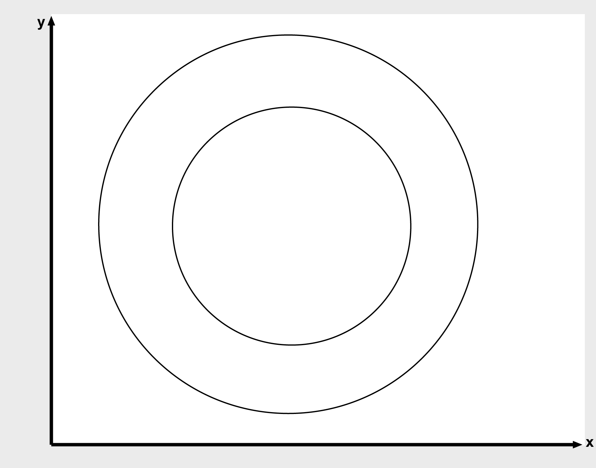
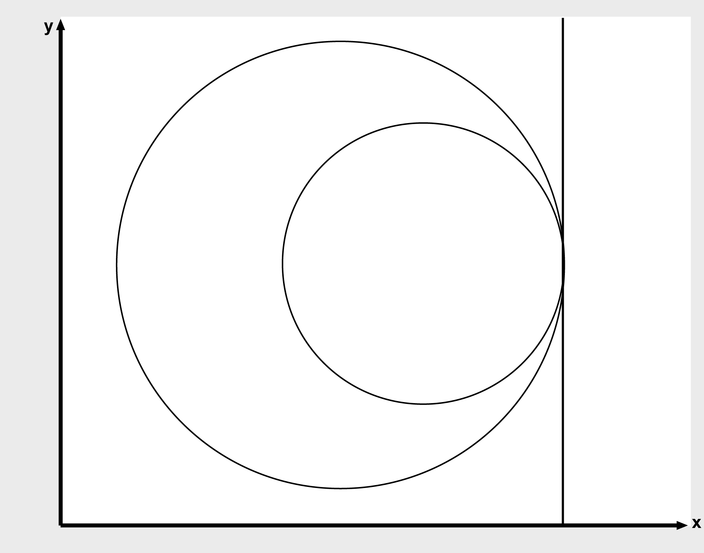
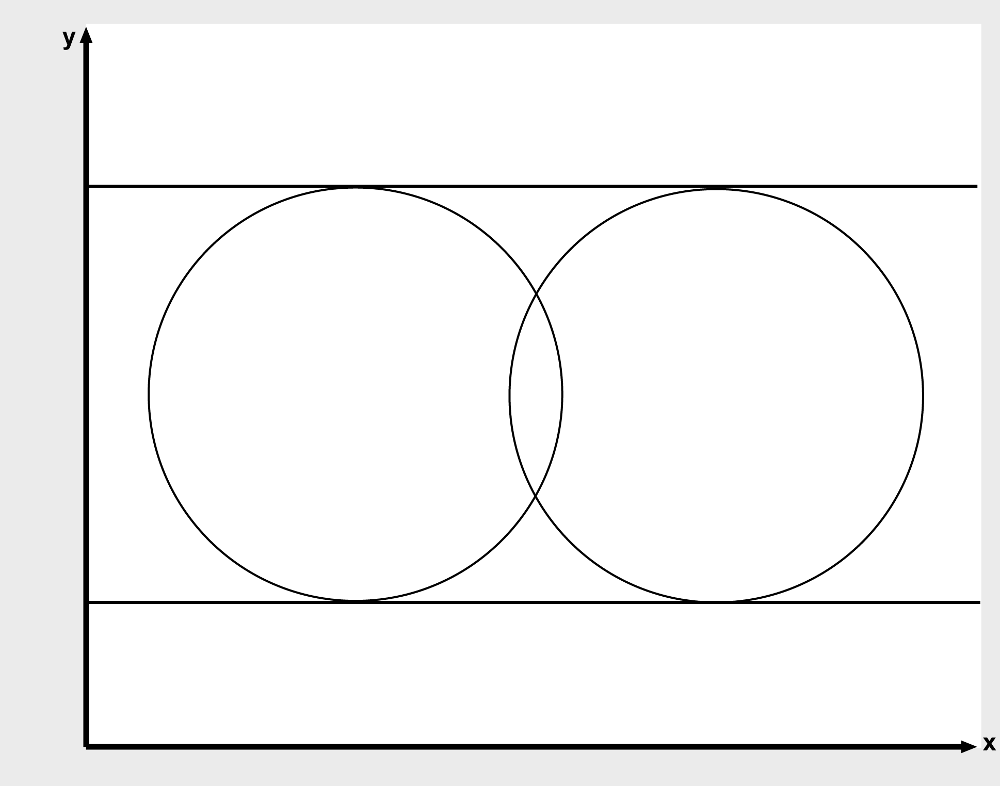
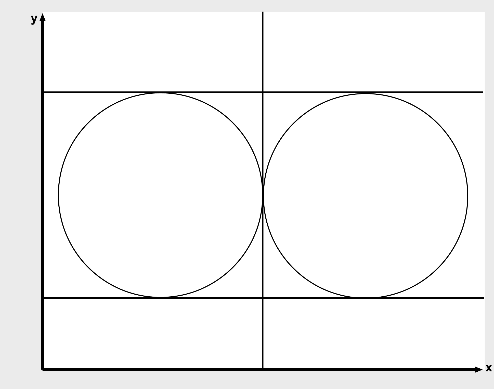
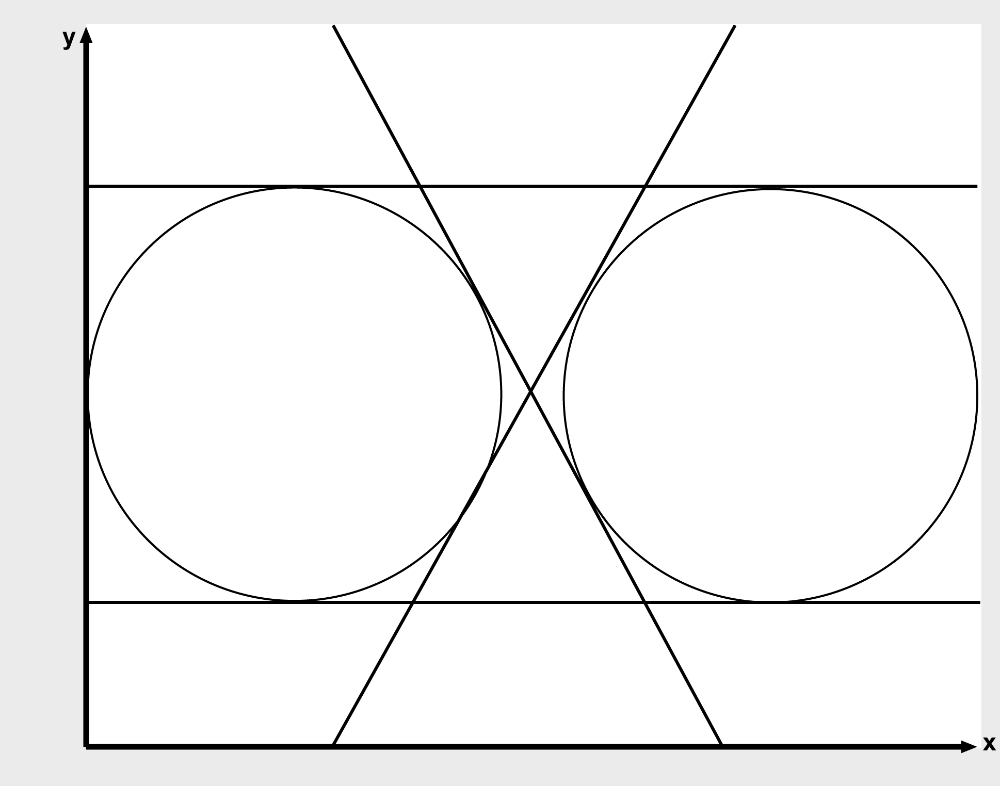

# FC\_CommonTangents2DTwoCircles

## Overview

|  |  |
| --- | --- |
| Type: | Function |
| Available as of: | V1.1.0.0 |

## Description

This function calculates the common tangents of a circle i\_stCircle1 and a circle i\_stCircle2 in the two-dimensional space.

The following scenarios are possible:

* No common tangent
* One common tangent
* Two common tangents
* Three common tangents
* Four common tangents
* Infinite number of common tangents (the circles coincide).

The following figures illustrate the different cases.

No common tangent

One common tangent

Two common tangents

Three common tangents

Four common tangents

## Interface

| Input | Data type | Description |
| --- | --- | --- |
| i\_stCircle1 | [ST\_Circle2D](ST_Circle2D-GeneralInformation-0C02751F.html#ST_Circle2D-GeneralInformation-0C02751F) | Circle 1 |
| i\_stCircle2 | [ST\_Circle2D](ST_Circle2D-GeneralInformation-0C02751F.html#ST_Circle2D-GeneralInformation-0C02751F) | Circle 2 |

| Output | Data type | Description |
| --- | --- | --- |
| q\_xError | BOOL | If this output is set to TRUE, an error has been detected. For details, refer to q\_etResult and q\_etResultMsg. |
| q\_etResult | [ET\_Result](ET_Result-GeneralInformation-0C182C26.html#ET_Result-GeneralInformation-0C182C26) | Provides diagnostic and status information as a numeric value. |
| q\_sResultMsg | STRING[80] | Provides additional diagnostic and status information as a text message. |
| q\_diNumberOfCommonTangents | DINT | Number of common tangents.  Possible values:  0: no common tangent  2: two common tangents  4: four common tangents  99: an infinite number of common tangents  In case of one common tangent, value 2 is listed with identical values.  In case of three common tangents, value 4 is listed with identical values. |
| q\_astTouchPointsCircle1 | ARRAY[1..4] OF [ST\_Vector2D](ST_Vector2D-GeneralInformation-0BFF6B0C.html#ST_Vector2D-GeneralInformation-0BFF6B0C) | Contact points of the tangents at circle 1 |
| q\_astTouchPointsCircle2 | ARRAY[1..4] OF [ST\_Vector2D](ST_Vector2D-GeneralInformation-0BFF6B0C.html#ST_Vector2D-GeneralInformation-0BFF6B0C) | Contact points of the tangents at circle 2 |

## Diagnostic Messages

| q\_xError | q\_etResult | Enumeration value | Description |
| --- | --- | --- | --- |
| FALSE | Ok | 0 | Success |
| TRUE | RadiusRangeCircle1 | 27 | The radius of circle 1 is outside the valid range. |
| TRUE | RadiusRangeCircle2 | 28 | The radius of circle 2 is outside the valid range. |

## Ok

|  |  |
| --- | --- |
| Enumeration name: | Ok |
| Enumeration value: | 0 |
| Description: | Success |

The tangents have been successfully calculated.

## RadiusRangeCircle1

|  |  |
| --- | --- |
| Enumeration name: | RadiusRangeCircle1 |
| Enumeration value: | 27 |
| Description: | The radius of circle 1 is outside the valid range. |

| Cause | Solution |
| --- | --- |
| The value at the input i\_stCircle1.lrRadius is less than or equal to 0. | The radius of the circle must be greater than zero. |

## RadiusRangeCircle2

|  |  |
| --- | --- |
| Enumeration name: | RadiusRangeCircle2 |
| Enumeration value: | 28 |
| Description: | The radius of circle 2 is outside the valid range. |

| Cause | Solution |
| --- | --- |
| The value at the input i\_stCircle2.lrRadius is less than or equal to 0. | The radius of the circle must be greater than zero. |

EIO0000002815.02