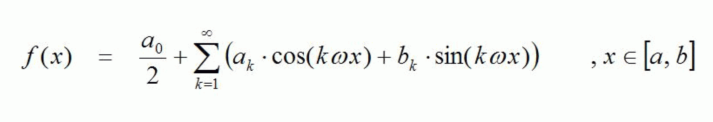
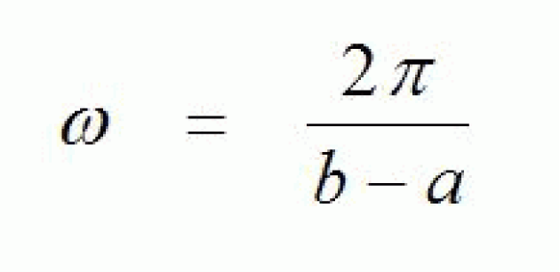
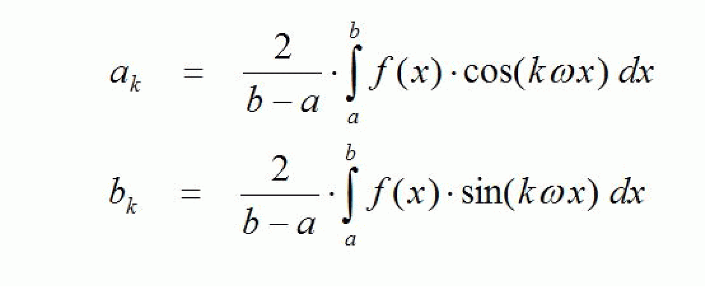

# FC\_FourierCoefficients

## Overview

|  |  |
| --- | --- |
| Type: | Function |
| Available as of: | V1.1.0.0 |

## Description

This function calculates Fourier coefficients. A periodic function f which is defined on an interval [a, b] can be represented as a Fourier series under suitable conditions:





Here, the Fourier coefficients ak and bk are provided by:



The function FC\_FourierCoefficients calculates the Fourier coefficients defined above up to index k = i\_diMaxIndex ("k-th harmonic"). The calculated Fourier coefficients are entered into arrays for which the start is provided to the function by using the pointers i\_plrFourierCoefficientsA (array for ak) and i\_plrFourierCoefficientsB (array for bk).

The function f is provided as a value table. The interval 0.0 ... i\_lrXPeriod is assumed as a definition range. i\_diNumberOfIntervals contains the length of the value table (number of partial intervals, into which the definition range [0.0, i\_lrXPeriod] is subdivided.

The calculated Fourier coefficients are used by the function FC\_FourierPartialSum to calculate finite Fourier partial sums. A possible usecase is filtering of higher harmonics.

## Interface

| Input | Data type | Description |
| --- | --- | --- |
| i\_lrXPeriod | LREAL | Period of the function / length of the definition range. |
| i\_diNumberOfIntervals | DINT | Number of partial intervals into which the definition range is split / length of the value table used for defining the function. |
| i\_diMaxIndex | DINT | Index up to which the Fourier coefficients are to be calculated.  The arrays, which i\_plrFourierCoefficientsA and i\_plrFourierCoefficientsB point to, must have at least i\_diMaxIndex entries. |

| Input/Output | Data type | Description |
| --- | --- | --- |
| iq\_alrFunctionValues | ARRAY[\*] OF LREAL | Array of the values which defines the function. |
| iq\_alrFourierCoefficientsA | ARRAY[\*] OF LREAL | Array of the coefficients into which the Fourier coefficients ak are to be entered. |
| iq\_alrFourierCoefficientsB | ARRAY[\*] OF LREAL | Array of the coefficients into which the Fourier coefficients bk are to be entered. |

| Output | Data type | Description |
| --- | --- | --- |
| q\_xError | BOOL | If this output is set to TRUE, an error has been detected. For details, refer to q\_etResult and q\_etResultMsg. |
| q\_etResult | [ET\_Result](ET_Result-GeneralInformation-0C182C26.html#ET_Result-GeneralInformation-0C182C26) | Provides diagnostic and status information as a numeric value. |
| q\_sResultMsg | STRING[80] | Provides additional diagnostic and status information as a text message. |

## Diagnostic Messages

| q\_xError | q\_etResult | Enumeration value | Description |
| --- | --- | --- | --- |
| FALSE | Ok | 0 | Success |
| TRUE | InvalidInputValue | 324 | At least one of the given input parameters is invalid. Detailed information is provided by the output q\_sResultMsg of the associated POU. |

## Example

```
PROGRAM SR_Main
VAR
	alrFunctionValues : ARRAY[0..360] OF LREAL;
	alrFourierCoeffsA : ARRAY[0..100] OF LREAL;
	alrFourierCoeffsB : ARRAY[0..100] OF LREAL;
	xError            : BOOL;
	etResult          : SE_Math.ET_Result;
	sResultMsg        : STRING;
	diJ               : DINT;
END_VAR

// Prepare table with function values
FOR diJ := 0 TO 359 DO
	alrFunctionValues[diJ] := TO_LREAL(diJ) + 0.5;
END_FOR

// Calculate Fourier Coefficients
SE_MATH.FC_FourierCoefficients(
	i_lrXPeriod                := 360.0,
	i_diNumberOfIntervals      := 360,
	iq_alrFunctionValues       := alrFunctionValues,
	i_diMaxIndex               := 50,
	iq_alrFourierCoefficientsA := alrFourierCoeffsA,
	iq_alrFourierCoefficientsB := alrFourierCoeffsB,
	q_xError                   => xError,
	q_etResult                 => etResult,
	q_sResultMsg               => sResultMsg
);
```

## InvalidInputValue

|  |  |
| --- | --- |
| Enumeration name: | InvalidInputValue |
| Enumeration value: | 324 |
| Description: | At least one of the given input parameters is invalid. Detailed information is provided by the output q\_sResultMsg of the associated POU. |

| Cause | Solution |
| --- | --- |
| The value at the input i\_diMaxIndex is invalid value. | Set the input i\_diMaxIndex to a value greater than zero. |
| The value at the input i\_diNumberOfIntervals is invalid. | The the input i\_diNumberOfIntervals to a value greater than 1. |
| The size of iq\_alrFunctionValues is lower than the value of the input i\_diNumberOfIntervals. | Verify the size of iq\_alrFunctionValues and the value of i\_diNumberOfIntervals. |
| The size of iq\_alrFourierCoefficientsA is lower than the value of the input i\_diMaxIndex. | Verify the size of iq\_alrFourierCoefficientsA and the value of i\_diMaxIndex. |
| The size of iq\_alrFourierCoefficientsB is lower than the value of the input i\_diMaxIndex. | Verify the size of iq\_alrFourierCoefficientsB and the value of i\_diMaxIndex. |
| The value a the input i\_lrXPeriod is less than Gc\_lrZeroTolerance. | Set the input i\_lrXPeriod to a value greater than zero. |

## Ok

|  |  |
| --- | --- |
| Enumeration name: | Ok |
| Enumeration value: | 0 |
| Description: | Success |

The coefficients have been successfully calculated.

EIO0000002815.02