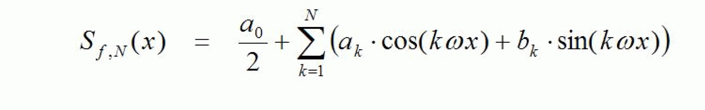

# FC\_FourierPartialSum

## Overview

|  |  |
| --- | --- |
| Type: | Function |
| Available as of: | V1.1.0.0 |

## Description

This function calculates the value of a finite Fourier partial sum. This requires the Fourier coefficients to have been calculated up to a sufficiently large index using the function FC\_FourierCoefficients.

Fourier partial sum for function *f* up to the index *N* (see FC\_FourierCoefficients for the definition of the Fourier coefficients):

Under suitable preconditions for the function *f*, S f, N approximates it for a sufficiently large *N*.

## Interface

| Input | Data type | Description |
| --- | --- | --- |
| i\_lrXPeriod | LREAL | Period of the function / length of the definition range |
| i\_diMaxIndex | DINT | Index up to which the Fourier partial sum is to be calculated (designated above as *N*). The Fourier coefficients must first have been calculated at least up to this index, using the function FC\_FourierCoefficients. |
| i\_lrXValue | LREAL | X value for which the Fourier partial sum is to be calculated. |

| Input/Output | Data type | Description |
| --- | --- | --- |
| iq\_alrFourierCoefficientsA | ARRAY[\*] OF LREAL | Array of the coefficients into which the Fourier coefficients ak are to be entered. |
| iq\_alrFourierCoefficientsB | ARRAY[\*] OF LREAL | Array of the coefficients into which the Fourier coefficients bk are to be entered. |

| Output | Data type | Description |
| --- | --- | --- |
| q\_xError | BOOL | If this output is set to TRUE, an error has been detected. For details, refer to q\_etResult and q\_etResultMsg. |
| q\_etResult | [ET\_Result](ET_Result-GeneralInformation-0C182C26.html#ET_Result-GeneralInformation-0C182C26) | Provides diagnostic and status information as a numeric value. |
| q\_sResultMsg | STRING[80] | Provides additional diagnostic and status information as a text message. |
| q\_lrFourierPartialSum | LREAL | Calculated value of the Fourier partial sum at the point i\_lrXValue. |

## Diagnostic Messages

| q\_xError | q\_etResult | Enumeration value | Description |
| --- | --- | --- | --- |
| FALSE | Ok | 0 | Success |
| TRUE | InvalidInputValue | 324 | At least one of the given input parameters is invalid. Detailed information is provided by the output q\_sResultMsg of the associated POU. |

## InvalidInputValue

|  |  |
| --- | --- |
| Enumeration name: | InvalidInputValue |
| Enumeration value: | 324 |
| Description: | At least one of the given input parameters is invalid. Detailed information is provided by the output q\_sResultMsg of the associated POU. |

| Cause | Solution |
| --- | --- |
| The value at the input i\_diMaxIndex is invalid. | Set the input i\_diMaxIndex to a value greater than zero. |
| The size of iq\_alrFourierCoefficientsA is lower than the value of the input i\_diMaxIndex. | Verify the size of iq\_alrFourierCoefficientsA and the value of i\_diMaxIndex. |
| The size of iq\_alrFourierCoefficientsB is lower than the value of the input i\_diMaxIndex. | Verify the size of iq\_alrFourierCoefficientsB and the value of i\_diMaxIndex. |
| The value at the input i\_lrXPeriod is less than Gc\_lrZeroTolerance. | Set the input i\_lrXPeriod to a value greater than zero. |

## Ok

|  |  |
| --- | --- |
| Enumeration name: | Ok |
| Enumeration value: | 0 |
| Description: | Success |

The partial sum has been successfully calculated.

EIO0000002815.02