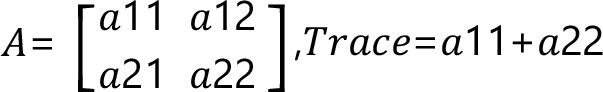

# FC\_Matrix2DTrace

## Overview

|  |  |
| --- | --- |
| Type: | Function |
| Available as of: | V1.1.0.0 |

## Description

Given a 2D input matrix, the function returns the trace of such matrix. The trace of a squared matrix is defined as the sum of the elements on its main diagonal.

## Interface

| Input | Data type | Description |
| --- | --- | --- |
| i\_stMatrix | [ST\_Matrix2D](ST_Matrix2D-GeneralInformation-0C04D259.html#ST_Matrix2D-GeneralInformation-0C04D259) | A 2D matrix. |

| Output | Data type | Description |
| --- | --- | --- |
| q\_xError | BOOL | If this output is set to TRUE, an error has been detected. For details, refer to q\_etResult and q\_etResultMsg. |
| q\_etResult | [ET\_Result](ET_Result-GeneralInformation-0C182C26.html#ET_Result-GeneralInformation-0C182C26) | Provides diagnostic and status information as a numeric value. |
| q\_sResultMsg | STRING[80] | Provides additional diagnostic and status information as a text message. |

## Return Value

| Data type | Description |
| --- | --- |
| LREAL | The function returns the trace of the input matrix. |

## Diagnostic Messages

| q\_xError | q\_etResult | Enumeration value | Description |
| --- | --- | --- | --- |
| FALSE | Ok | 0 | Success |

## Ok

|  |  |
| --- | --- |
| Enumeration name: | Ok |
| Enumeration value: | 0 |
| Description: | Success |

EIO0000002815.02