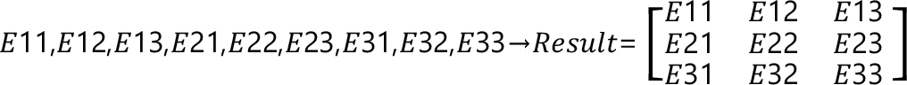

# FC\_Matrix3DSetElements

## Overview

|  |  |
| --- | --- |
| Type: | Function |
| Available as of: | V1.1.0.0 |

## Description

Given a set of input elements, the function returns a new 3D matrix that contains such elements.

## Interface

| Input | Data type | Description |
| --- | --- | --- |
| i\_lrE11 | LREAL | Element (1, 1) of the matrix. |
| i\_lrE12 | LREAL | Element (1, 2) of the matrix. |
| i\_lrE13 | LREAL | Element (1, 3) of the matrix. |
| i\_lrE21 | LREAL | Element (2, 1) of the matrix. |
| i\_lrE22 | LREAL | Element (2, 2) of the matrix. |
| i\_lrE23 | LREAL | Element (2, 3) of the matrix. |
| i\_lrE31 | LREAL | Element (3, 1) of the matrix. |
| i\_lrE32 | LREAL | Element (3, 2) of the matrix. |
| i\_lrE33 | LREAL | Element (3, 3) of the matrix. |

| Output | Data type | Description |
| --- | --- | --- |
| q\_xError | BOOL | If this output is set to TRUE, an error has been detected. For details, refer to q\_etResult and q\_etResultMsg. |
| q\_etResult | [ET\_Result](ET_Result-GeneralInformation-0C182C26.html#ET_Result-GeneralInformation-0C182C26) | Provides diagnostic and status information as a numeric value. |
| q\_sResultMsg | STRING[80] | Provides additional diagnostic and status information as a text message. |

## Return Value

| Data type | Description |
| --- | --- |
| [ST\_Matrix3D](ST_Matrix3D-GeneralInformation-0C04E9BF.html#ST_Matrix3D-GeneralInformation-0C04E9BF) | The function returns a new 3D matrix that contains the input elements. |

## Diagnostic Messages

| q\_xError | q\_etResult | Enumeration value | Description |
| --- | --- | --- | --- |
| FALSE | Ok | 0 | Success |

## Ok

|  |  |
| --- | --- |
| Enumeration name: | Ok |
| Enumeration value: | 0 |
| Description: | Success |

EIO0000002815.02