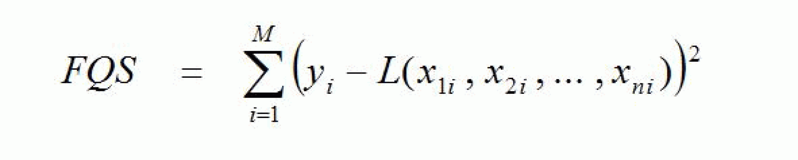
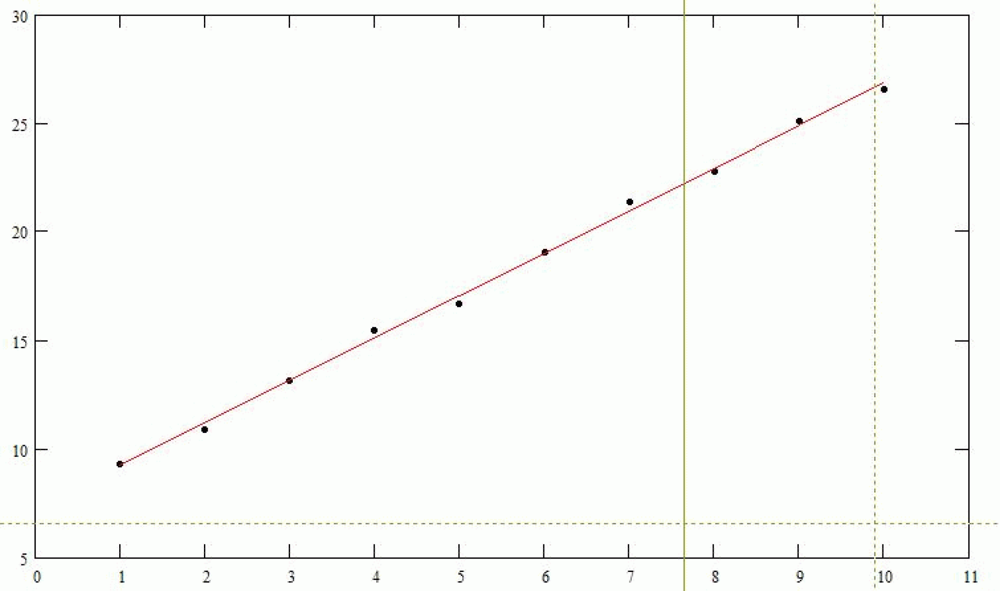
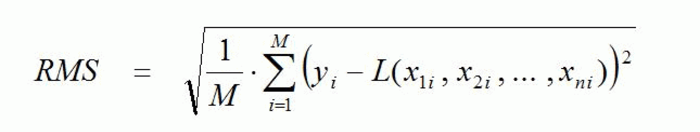

# FC\_MultipleRegression

## Overview

|  |  |
| --- | --- |
| Type: | Function |
| Available as of: | V1.1.0.0 |

## Description

This function calculates the regression coefficients for a given value pairs or value tuples. The main task of **regression analysis** is to calculate the linear functions that best approximate the values, based on a series of values for which a linear relationship is known or suspected. The best approximation is the linear function with the minimum error sum of squares relative to the values. The proportionality factors in these linear functions are referred to as regression coefficients. If the values are value pairs

(xi , yi ) ; i = 1, ... , M

then the approximating linear function is referred to as **regression line.** If it is (n+1)-tuple (n > 1)

(x1i , x2i , ... , xni , yi ) ; i = 1, ... , M

then it is referred to as a **regression plane**. M is the number of values.

The different designations x and y are due to the fact that in practice there is usually one dependent variable (y) and one or more independent variables (x).

The task of linear regression is, therefore, to calculate a linear function

y = L (x1 , x2 , ... , xn)

so that the error sum of squares becomes minimal:



The function L can be presented as:

L (x1 , x2 , ... , xn) = k0 + k1 \* x1 + ... + kn \* xn

The constants k0 , ... , kn are the above-mentioned **regression coefficients** which are to be calculated.

The following figure shows an example of a regression line:



The root mean square (RMS) value can be used as a measure of the scatter of the values around the calculated regression function. It is defined as:



## Interface

| Input | Data type | Description |
| --- | --- | --- |
| i\_diDimX | DINT | Number of the independent variables xi (designated as *n* above).  Value range: >= 1 |
| i\_diDimY | DINT | Number of value tuples (designated as *M* above).  Value range: >= i\_diDimX + 1 |

| Input/Output | Data type | Description |
| --- | --- | --- |
| iq\_alrXMatrix | ARRAY[\*, \*] OF LREAL | Two-dimensional array where the measured values for the independent variables are stored.  The size of the first dimension must be at least i\_diDimX.  The size of the second dimension must be at least i\_diDimY. |
| iq\_alrYVector | ARRAY[\*] OF LREAL | Array where the measured values for the independent variables are stored.  The size of the array must be at least i\_diDimY. |
| iq\_alrCoefficients | ARRAY[\*] OF LREAL | Array where the calculated regression coefficients are stored.  The size of the array must be at least i\_diDimX + 1. |

| Output | Data type | Description |
| --- | --- | --- |
| q\_xError | BOOL | If this output is set to TRUE, an error has been detected. For details, refer to q\_etResult and q\_etResultMsg. |
| q\_etResult | [ET\_Result](ET_Result-GeneralInformation-0C182C26.html#ET_Result-GeneralInformation-0C182C26) | Provides diagnostic and status information as a numeric value. |
| q\_sResultMsg | STRING[80] | Provides additional diagnostic and status information as a text message. |
| q\_lrRMSError | LREAL | Root Mean Square Error (see above). It is a measure of how well the given values can be approximated linearly. The greater this value, the greater the scatter of the values around the regression line / plane. |

## Example 1

Determining the moment of inertia of an indeterminable load from torque and angle acceleration

A motor drives a constant load for which the moment of inertia is indeterminable and which is to be calculated. The following values were recorded:

|  |  |  |  |  |  |  |  |  |  |  |
| --- | --- | --- | --- | --- | --- | --- | --- | --- | --- | --- |
| **Torque M** [Nm] | 3.3 | 4.4 | 6.2 | 8.0 | 8.7 | 10.6 | 12.4 | 13.3 | 15.1 | 16.1 |
| **Acceleration Acc** [rad / s2] | 30.0 | 60.0 | 90.0 | 120.0 | 150.0 | 180.0 | 210.0 | 240.0 | 270.0 | 300.0 |

Code example:

```
VAR
	diDimX                    : DINT;
	diDimY                    : DINT;
	diJ                       : DINT;
	xError                    : BOOL;
	etResult                  : SE_MATH.ET_Result;
	sResultMsg                : STRING(80);
	lrRMSError                : LREAL;
	alrXMatrix                : ARRAY[1..10, 1..1] OF LREAL;
	alrYVector                : ARRAY[1..10] OF LREAL;
	alrRegressionCoefficients : ARRAY[0..1] OF LREAL;
	alrTorqueValues           : ARRAY[1..10] OF LREAL := [3.3, 4.4, 6.2, 8.0, 8.7, 10.6, 12.4, 13.3, 15.1, 16.1];
	alrAccValues              : ARRAY[1..10] OF LREAL := [30.0, 60.0, 90.0, 120.0, 150.0, 180.0, 210.0, 240.0, 270.0, 300.0];
END_VAR

// Set dimensions
diDimX:= 1; // 1 independent variable (Acc)
diDimY:= 10; // 10 measurements

// Set input arrays
FOR diJ:= 1 TO diDimY DO
	alrXMatrix[diJ,1] := alrAccValues[diJ];
	alrYVector[diJ] := alrTorqueValues[diJ];
END_FOR

// Calculate regression coefficients
SE_MATH.FC_MultipleRegression(
	i_diDimX:= diDimX, 
	i_diDimY:= diDimY, 
	iq_alrXMatrix:= alrXMatrix, 
	iq_alrYVector:= alrYVector, 
	iq_alrCoefficients:= alrRegressionCoefficients, 
	q_xError=> xError, 
	q_etResult=> etResult, 
	q_sResultMsg=> sResultMsg, 
	q_lrRMSError=> lrRMSError
);
```

This calculation returns as regression coefficients:

alrRegressionCoefficients[0] = 1.787

alrRegressionCoefficients[1] = 4.863e-2

The best linear approximation of the above values thus is:

M = 1.787 Nm + 4.863e-2 kgm2 \* Acc

Therefore, the moment of inertia wanted is J = 4.863e-2 kgm2. In addition, there is a breakaway torque of M0 = 1.787 Nm.

## Example 2

Determining the belttracking plane of a robot by teaching.

Movemements are performed to different points on the belttracking plane and the coordinates are read out. From this, the equation of the belttracking plane is to be determined.

The following points were recorded:

|  |  |  |  |  |  |
| --- | --- | --- | --- | --- | --- |
| X coordinate | 0.1 | 100.1 | -0.1 | 100.0 | 50.1 |
| Y coordinate | 0.1 | -0.1 | 99.9 | 100.1 | 49.9 |
| Z coordinate | 19.9 | 521.1 | -679.8 | -180.5 | -79.0 |

The plane equation has to be set to the form

Z = k0 + kx \* X + ky \* Y

In this case, therefore, X and Y are the independent variables, Z is the dependent variable.

Code example:

```
VAR
	diDimX                    : DINT;
	diDimY                    : DINT;
	diJ                       : DINT;
	xError                    : BOOL;
	etResult                  : SE_MATH.ET_Result;
	sResultMsg                : STRING(80);
	lrRMSError                : LREAL;
	alrXMatrix                : ARRAY[1..5, 1..2] OF LREAL;
	alrYVector                : ARRAY[1..5] OF LREAL;
	alrRegressionCoefficients : ARRAY[0..2] OF LREAL;
	alrXValues                : ARRAY[1..5] OF LREAL := [0.1, 100.1, -0.1, 100.0, 50.1];
	alrYValues                : ARRAY[1..5] OF LREAL := [0.1, -0.1, 99.9, 100.1, 49.9];
	alrZValues                : ARRAY[1..5] OF LREAL := [19.9, 521.1, -679.8, -180.5, -79.0];
END_VAR

// Set dimensions
diDimX := 2; // 2 independent variables (X and Y)
diDimY := 5; // 5 points

// Set input arrays
FOR diJ := 1 TO diDimY DO
	alrXMatrix[diJ, 1] := alrXValues[diJ];
	alrXMatrix[diJ, 2] := alrYValues[diJ];
	alrYVector[diJ]    := alrZValues[diJ];
END_FOR

// Calculate regression coefficients
SE_MATH.FC_MultipleRegression(
	i_diDimX           := diDimX,
	i_diDimY           := diDimY,
	iq_alrXMatrix      := alrXMatrix,
	iq_alrYVector      := alrYVector,
	iq_alrCoefficients := alrRegressionCoefficients,
	q_xError           => xError,
	q_etResult         => etResult,
	q_sResultMsg       => sResultMsg,
	q_lrRMSError       => lrRMSError
);
```

This calculation returns as regression coefficients:

alrRegressionCoefficients[0] = 19.949

alrRegressionCoefficients[1] = 4.999

alrRegressionCoefficients[2] = -6.998

The plane equation therefore is

Z = 19.949 + 4.999 \* X - 6.998 \* Y

## Diagnostic Messages

| q\_xError | q\_etResult | Enumeration value | Description |
| --- | --- | --- | --- |
| FALSE | Ok | 0 | Success |
| TRUE | DynIecDataSizeTooSmall | 75 | There is not enough dynamic memory reserved. |
| TRUE | InvalidInputValue | 324 | At least one of the given input parameters is invalid. Detailed information is provided by the output q\_sResultMsg of the associated POU. |
| TRUE | UnexpectedFeedback | 1 | An error was detected during execution. |

## DynIecDataSizeTooSmall

|  |  |
| --- | --- |
| Enumeration name: | DynIecDataSizeTooSmall |
| Enumeration value: | 75 |
| Description: | There is not enough dynamic memory reserved. |

| Cause | Solution |
| --- | --- |
| There is no or not enough dynamic memory available. | Increase the available dynamic memory Controller > Configuration > Program > DynIECDataSize. |

## InvalidInputValue

|  |  |
| --- | --- |
| Enumeration name: | InvalidInputValue |
| Enumeration value: | 324 |
| Description: | At least one of the given input parameters is invalid. Detailed information is provided by the output q\_sResultMsg of the associated POU. |

| Cause | Solution |
| --- | --- |
| The value at the input i\_diDimX is invalid. | Set i\_diDimX to a value greater than 0. |
| The value at the input i\_diDimY is invalid. | Set i\_diDimY to a value greater than i\_diDimX. |
| The size of the first dimension of iq\_alrXMatrix is lower than the value of the input i\_DimX. | Verify the size of iq\_alrXMatrix and the value of i\_DimX. |
| The size of the second dimension of iq\_alrXMatrix is lower than the value of the input i\_DimY. | Verify the size of iq\_alrXMatrix and the value of i\_DimY. |
| The size of iq\_alrYVector is lower than the value of the input i\_DimY. | Verify the size of iq\_alrYVector and the value of i\_DimY. |
| The size of iq\_alrCoefficients is lower than the value of the input i\_DimX + 1. | Verify the size of iq\_alrCoefficients and the value of i\_DimX. |

## Ok

|  |  |
| --- | --- |
| Enumeration name: | Ok |
| Enumeration value: | 0 |
| Description: | Success |

The regression coefficients have been successfully calculated.

## UnexpectedFeedback

|  |  |
| --- | --- |
| Enumeration name: | UnexpectedFeedback |
| Enumeration value: | 1 |
| Description: | An error was detected during execution. |

| Cause | Solution |
| --- | --- |
| Error detected in the execution. | Contact your Schneider Electric service representative. |

EIO0000002815.02