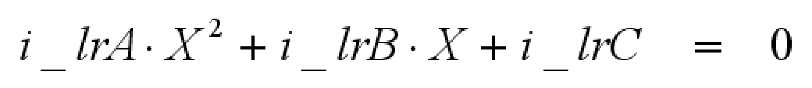

# FC\_Polynomial2Zeros

## Overview

|  |  |
| --- | --- |
| Type: | Function |
| Available as of: | V1.1.0.0 |

## Description

This function provides solutions of the second degree equation:

The solutions are complex numbers which are returned in a structure of type [ST\_PolynomialZeros](ST_PolynomialZeros-GeneralInformati-0C08490F.html#ST_PolynomialZeros-GeneralInformati-0C08490F).

## Interface

| Input | Data type | Description |
| --- | --- | --- |
| i\_lrA | LREAL | Factor for X2 |
| i\_lrB | LREAL | Factor for X |
| i\_lrC | LREAL | Constant term |

| Output | Data type | Description |
| --- | --- | --- |
| q\_xError | BOOL | If this output is set to TRUE, an error has been detected. For details, refer to q\_etResult and q\_etResultMsg. |
| q\_etResult | [ET\_Result](ET_Result-GeneralInformation-0C182C26.html#ET_Result-GeneralInformation-0C182C26) | Provides diagnostic and status information as a numeric value. |
| q\_sResultMsg | STRING[80] | Provides additional diagnostic and status information as a text message. |

## Return Value

| Data type | Description |
| --- | --- |
| [ST\_PolynomialZeros](ST_PolynomialZeros-GeneralInformati-0C08490F.html#ST_PolynomialZeros-GeneralInformati-0C08490F) | Zeros of the function |

## Diagnostic Messages

| q\_xError | q\_etResult | Enumeration value | Description |
| --- | --- | --- | --- |
| FALSE | Ok | 0 | Success |

## Ok

|  |  |
| --- | --- |
| Enumeration name: | Ok |
| Enumeration value: | 0 |
| Description: | Success |

The zeros have been successfully calculated.

EIO0000002815.02