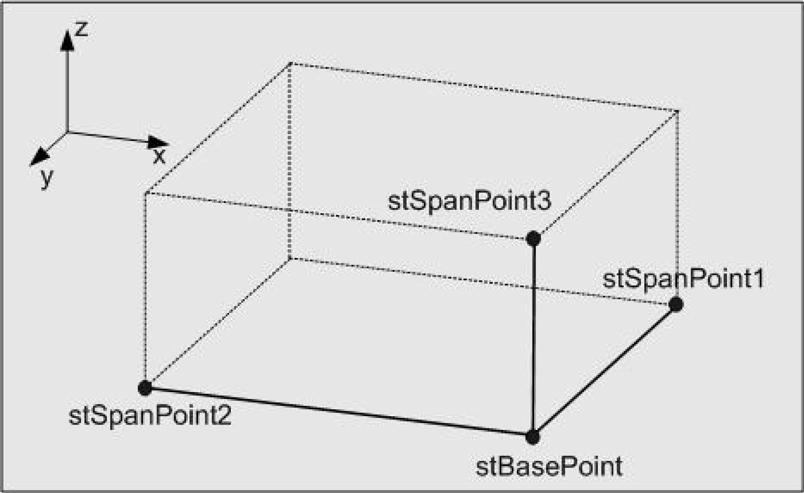

# ST\_Box

## Overview

|  |  |
| --- | --- |
| Type: | Structure |
| Available as of: | V1.0.1.0 |

## Description

The structure ST\_Box represents a cuboid in the three-dimensional space. The cuboid is defined by a common point and three edge points.

The points are illustrated by the following diagram:

## Structure Elements

| Name | Data type | Description |
| --- | --- | --- |
| stBasePoint | [ST\_Vector3D](ST_Vector3D-GeneralInformation-0FB413FF.html#ST_Vector3D-GeneralInformation-0FB413FF) | Common point of the edges. |
| stSpanPoint1 | [ST\_Vector3D](ST_Vector3D-GeneralInformation-0FB413FF.html#ST_Vector3D-GeneralInformation-0FB413FF) | First edge point, together with stBasePoint. |
| stSpanPoint2 | [ST\_Vector3D](ST_Vector3D-GeneralInformation-0FB413FF.html#ST_Vector3D-GeneralInformation-0FB413FF) | Second edge point, together with stBasePoint. |
| stSpanPoint3 | [ST\_Vector3D](ST_Vector3D-GeneralInformation-0FB413FF.html#ST_Vector3D-GeneralInformation-0FB413FF) | Third edge point, together with stBasePoint. |

EIO0000002815.02