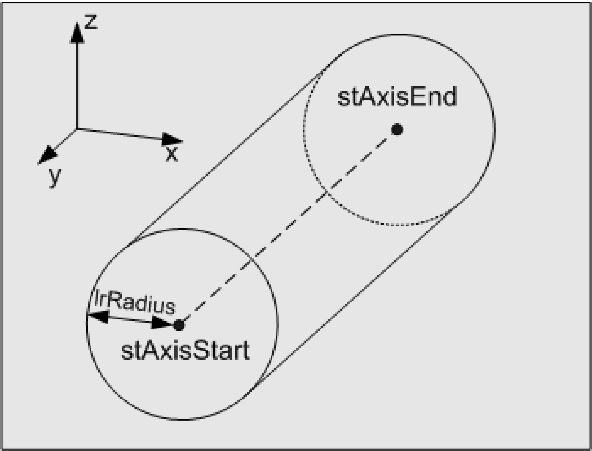

# ST\_Cylinder

## Overview

|  |  |
| --- | --- |
| Type: | Structure |
| Available as of: | V1.0.1.0 |

## Description

The structure ST\_Cylinder represents a cylinder. The cylinder axis is defined by the start point and end point.

## Structure Elements

| Name | Data type | Description |
| --- | --- | --- |
| stAxisStart | [ST\_Vector3D](ST_Vector3D-GeneralInformation-0FB413FF.html#ST_Vector3D-GeneralInformation-0FB413FF) | Start point of the cylinder axis. |
| stAxisEnd | [ST\_Vector3D](ST_Vector3D-GeneralInformation-0FB413FF.html#ST_Vector3D-GeneralInformation-0FB413FF) | End point of the cylinder axis. |
| lrRadius | LREAL | Radius of the cylinder. |

EIO0000002815.02