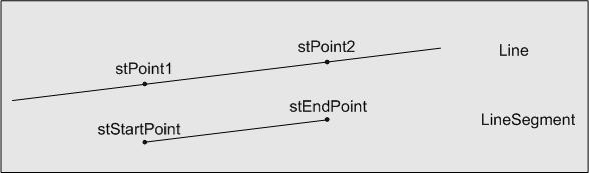

# ST\_LineSegment2D

## Overview

|  |  |
| --- | --- |
| Type: | Structure |
| Available as of: | V1.0.1.0 |

## Description

The structure ST\_LineSegment2D represents the line segment in a two-dimensional space which starts with the point stStartPoint and ends with the point stEndPoint.

NOTE: In contrast to a straight line, a line segment has a finite extension, as it does not go beyond the defining points. The points stStartPoint and stEndPoint may also be equal. In this case, the line segment is reduced to a single point.

The following figure illustrates the difference between a straight line and a line segment:

## Structure Elements

| Name | Data type | Description |
| --- | --- | --- |
| stStartPoint | [ST\_Vector2D](ST_Vector2D-GeneralInformation-0BFF6B0C.html#ST_Vector2D-GeneralInformation-0BFF6B0C) | Start point of the line segment. |
| stEndPoint | [ST\_Vector2D](ST_Vector2D-GeneralInformation-0BFF6B0C.html#ST_Vector2D-GeneralInformation-0BFF6B0C) | End point of the line segment. |

EIO0000002815.02