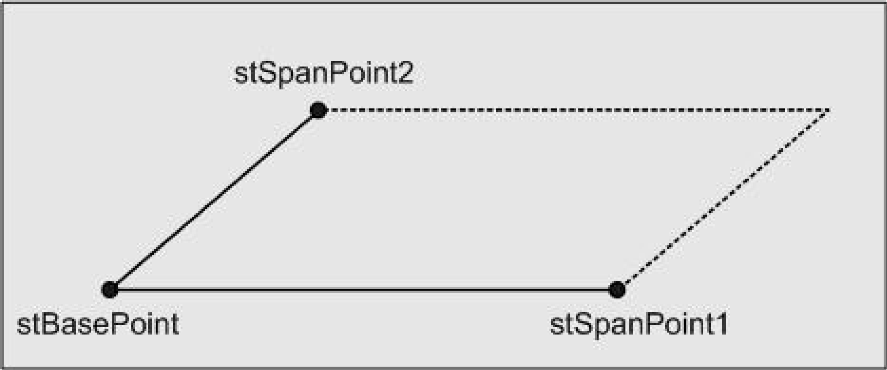

# ST\_Parallelogram

## Overview

|  |  |
| --- | --- |
| Type: | Structure |
| Available as of: | V1.0.1.0 |

## Description

The structure ST\_Parallelogram represents a parallelogram in two-dimensional space. The parallelogram is defined by the position vectors of three points.

The following figure illustrates the points:

## Structure Elements

| Name | Data type | Description |
| --- | --- | --- |
| stBasePoint | [ST\_Vector2D](ST_Vector2D-GeneralInformation-0BFF6B0C.html#ST_Vector2D-GeneralInformation-0BFF6B0C) | Common point of the edges. |
| stSpanPoint1 | [ST\_Vector2D](ST_Vector2D-GeneralInformation-0BFF6B0C.html#ST_Vector2D-GeneralInformation-0BFF6B0C) | First edge point, together with stBasePoint. |
| stSpanPoint2 | [ST\_Vector2D](ST_Vector2D-GeneralInformation-0BFF6B0C.html#ST_Vector2D-GeneralInformation-0BFF6B0C) | Second edge point, together with stBasePoint. |

EIO0000002815.02