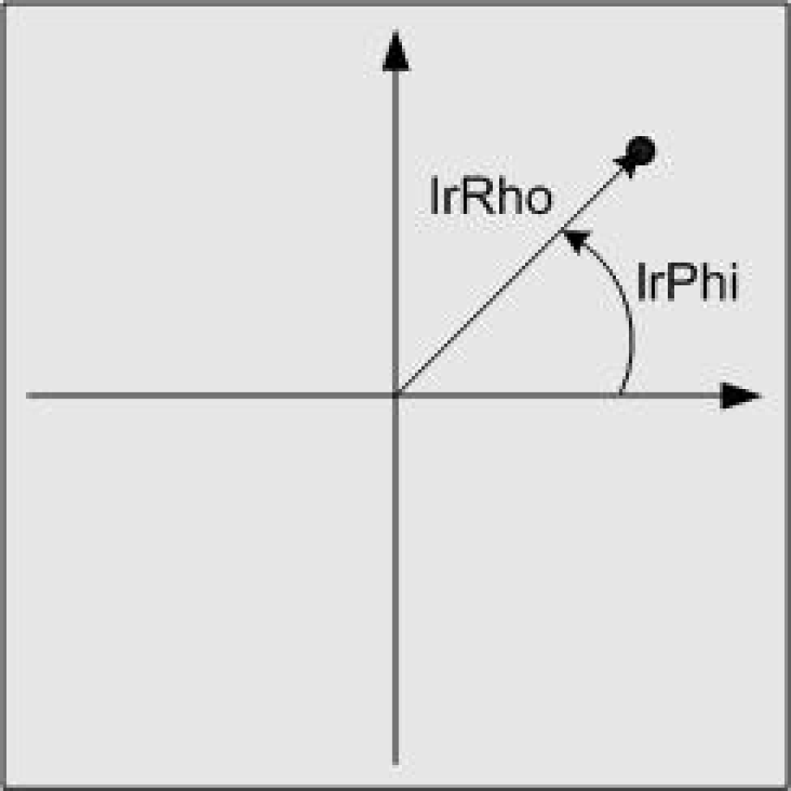

# ST\_PlanarPolarCoordinates

## Overview

|  |  |
| --- | --- |
| Type: | Structure |
| Available as of: | V1.0.1.0 |

## Description

The structure ST\_PlanarPolarCoordinates represents the position of a point using polar coordinates. The position of the point is described by the distance from the origin of the coordinate system and the angle of the straight line through origin that passes the point to the horizontal axis of the coordinate system. The angle is indicated in the mathematically positive direction (counterclockwise).

## Structure Elements

| Name | Data type | Description |
| --- | --- | --- |
| lrRho | LREAL | Distance of the point from the origin of the coordinate system |
| lrPhi | LREAL | Angle of the straight line through origin that passes the point to the horizontal axis of the coordinate system.  The angle is indicated in the mathematically positive direction (counterclockwise). |

EIO0000002815.02