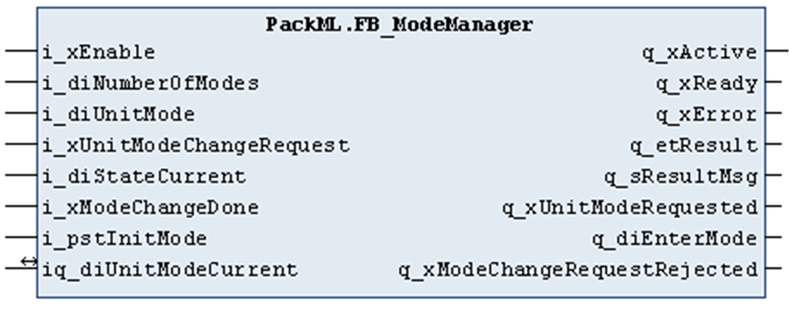

# FB\_ModeManager

## Overview

|  |  |
| --- | --- |
| Type: | Function block |
| Available as of: | V1.0.1.0 |

## Functional Description

The function block FB\_ModeManager can be used to manage mode change requests in a machine application, which is based on the PackML [state model](D-SE-0077929.html#D-SE-0077929__D-SE-0077929.6). Based on the unit mode definition the function block verifies whether the requested mode change is possible or not.

The unit mode definition comprises the definition of the possible states for each available control mode and the definition, from which state a mode change is permitted. For executing the unit mode definition, the auxiliary functions FC\_InitStateModelStateChange and FC\_InitStateModelExistingStates can be used.

Finally, the unit mode definition must be provided in an array of type ST\_UnitModeDefinition. The indexes of the array correspond to the numeric value of the available control modes (refer to ET\_Modes).

The unit mode definition must be made at start (initialization phase) of an application, prior to the first call with i\_xEnable = TRUE of the instance of the function block FB\_ModeManager.

Upon a rising edge of the input i\_xEnable, the initialization phase of the function block FB\_ModeManager is executed. During this phase, the unit state definitions for each available control mode are verified whether a PackML compliant state model can be created. If the initialization is completed successfully, the function block is ready for operation, which is indicated by the output q\_xReady.

During initialization, the following conditions are verified:

* The maximum number of states is 17.
* The states Execute and Stopped are obligatory states for each control mode.
* The state Completing requires the state Complete too.
* The states Holding and Unholding require in each case the state Held too.
* The states Suspending and UnSuspending require in each case the state Suspended too.
* The states Aborting and Clearing require in each case the state Aborted too.
* The states Resetting and Idle can be used only in combination.

During normal operation, the function block verifies the mode change request, which is indicated by the inputs i\_diUnitMode and i\_xUnitModeChange, in relation to the present control mode (iq\_diUnitModeCurrent) and the present state (i\_diStateCurrent). Exclusively a rising edge on i\_sUnitModeChange triggers an execution of the function block. The result is indicated by the outputs q\_diEnterMode, and q\_xModeChangeRequestRejected. If the mode change is permitted, the output q\_xModeChangeRequestRejected indicates FALSE and the output q\_diEnterMode is updated with the value of the requested mode. If so, the required steps to change the control mode must be executed depending on your application. Afterwards the information that the mode change was executed must be passed to the function block through the input i\_xModeChangeDone. If this input indicates TRUE, the variable linked to the input / output iq\_diUnitModeCurrent is updated with the previously requested control mode.

## Interface

| Input | Data type | Description |
| --- | --- | --- |
| i\_xEnable | BOOL | Activation and initialization of the function block. |
| i\_diNumberOfModes | DINT | Number of operation modes  If the value is changed, a reinitialization of the function block is required. |
| i\_diUnitMode | DINT | Requested operation mode  The PackTag Command.UnitMode should be applied to the input. |
| i\_xUnitModeChangeRequest | BOOL | Upon a rising edge, the function block verifies whether a change of operation mode is possible.  The PackTag Command.UnitModeChangeRequest should be applied to the input. |
| i\_diStateCurrent | DINT | Machine present state  The PackTag Status.StateCurrent should be applied to the input. |
| i\_xModeChangeDone | BOOL | Feedback from the application that the requested mode change has been executed. Upon a rising edge, the variable linked to iq\_diUnitModeCurrent is updated accordingly. |
| i\_pstInitMode | POINTER TO ST\_UnitModeDefinition | Through this input, the pointer address to the unit mode definitions is passed to the function block.\*  \* The unit mode definition provides the state definitions for each available operation mode and must be provided in an array of ST\_UnitModeDefinition. The indexes of the array correspond to the numeric value of the available control modes (refer to ET\_Modes). Therefore the pointer must point to the index which is associated to the operation mode Producing, which is the first mode. |

| Input / output | Data type | Description |
| --- | --- | --- |
| iq\_diUnitModeCurrent | DINT | Through the variable linked to this input / output, the function block obtains the present operation mode on a change request and it writes the new operation mode after the change has been performed.  The PackTag Status.UnitModeCurrent should be applied to the input/output. |

| Output | Data type | Description |
| --- | --- | --- |
| q\_xActive | BOOL | If this output is set to TRUE, the function block is active. |
| q\_xError | BOOL | If this output is set to TRUE, an error has been detected. Refer to ET\_Result. |
| q\_xReady | BOOL | If this output is set to TRUE, the function block is ready for operation. |
| q\_etResult | ET\_Result | Enumeration with the result. |
| q\_sResultMsg | STRING[80] | Additional result message. |
| q\_xUnitModeRequested | BOOL | This reflects the input i\_xUnitModeChangeRequest.  The PackTag Status.UnitModeRequested should be applied to this output. |
| q\_diEnterMode | DINT | This indicates the operation mode which is to be changed to. If the function block is deactivated, the output is set to 0. |
| q\_xModeChangeRequestRejected | BOOL | As long as this output indicates TRUE, a mode change request is not authorized by this function block and should not be performed. |

EIO0000002809.03