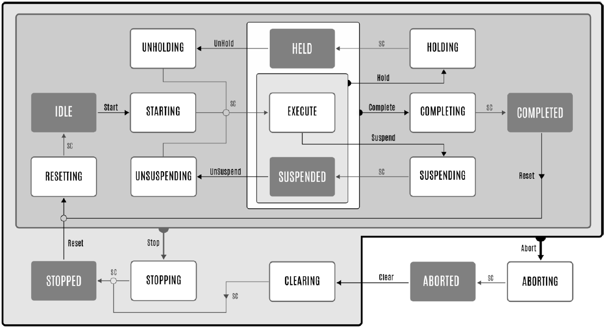

# PackML Base State Model

## Overview

The following diagram illustrates the PackML base state model as per ANSI/ISA TR88.00.02 – 2022. The base state model represents the complete set of defined states, state commands, and state transitions.

**SC**: State Completed (state transition from an acting state, in white background, to the succeeding state, in grey background)

EIO0000002809.03