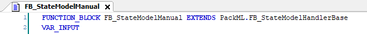

# FB\_StateModelHandlerBase – General Information

## Overview

|  |  |
| --- | --- |
| Type: | Function block |
| Available as of: | V1.4.2.0 |

## Functional Description

The FB\_StateModelHandlerBase function block is used to implement the control logic for each state of a state model.

The function block must not be instantiated directly, but must be extended by a custom function block. Inside your own state model handler function block, use the keyword EXTENDS in combination with the function block name. In this way, your function block inherits the methods, properties, and local variables of the base function block.

The function block provides the methods according to the states 1...17 of the PackML base state model. The methods are called in the application via the ExecuteCurrentState() method of the block FB\_UnitModeManager2. To do this, the instance of the function block that extends the FB\_StateModelHandlerBase must be assigned to a unit mode managed by the FB\_UnitModeManager2. The unit mode definition must be done using the method FB\_UnitModeManager2.DefineUnitModeWithHandler().

The state methods of the FB\_StateModelHandlerBase do not contain the custom logic. The custom logic is added by overriding the methods under the extending block.

The inputs of the state methods provide access to the state commands and the present unit mode.

With the input i\_ifCommands, it is possible to issue a state command within the methods by calling theFB\_UnitModeManager2.

The i\_ifUnitMode input gives you access to information about the present unit mode. This makes it possible to perform certain actions within the method depending on the unit mode. This allows the use of the same state model handler for different unit modes.

Another option is to create multiple custom state model handlers which have access to a common implementation through extension or inheritance. With this option, you can implement only the differences by overriding the respective method.

EIO0000002809.03