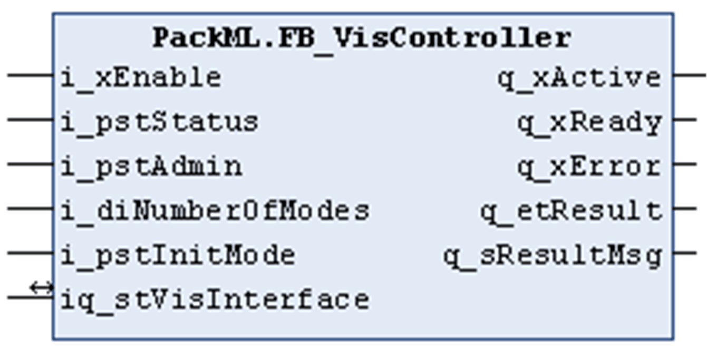

# FB\_VisController

## Overview

|  |  |
| --- | --- |
| Type: | Function block |
| Available as of: | V1.0.1.0 |

## Functional Description

The FB\_VisController is used to transfer the data (PackTags) from the application into the data structure of type ST\_VisInterface which is used by the visualization frames provided with the PackML library. Further, the function block implements functions to control the appearance of the visualization. For example: the scrolling through the alarm list and the control of state-dependent background colors for alarms.

## Interface

| Input | Data type | Description |
| --- | --- | --- |
| i\_xEnable | BOOL | Activation and initialization of the function block. |
| i\_pstStatus | POINTER TO ST\_Status | Through this input, the pointer address to the PackTags of type ST\_Status is passed to the function block. |
| i\_pstAdmin | POINTER TO ST\_Administration | Through this input, the pointer address to the PackTags of type ST\_Administration is passed to the function block. |
| i\_diNumberOfModes | DINT | Number of operation modes.  If the value is changed, a reinitialization of the function block is required. |
| i\_pstInitMode | POINTER TO ST\_UnitModeDefinition | Through this input, the pointer address to the unit mode definitions is passed to the function block.\*  \* The unit mode definition provides the state definitions for each available operation mode and must be provided in an array of ST\_UnitModeDefinition. The indexes of the array correspond to the numeric value of the available control modes (refer to ET\_Modes). Therefore, the pointer must point to the index which is associated to the operation mode Producing, which is the first mode. |

| Input / Output | Data type | Description |
| --- | --- | --- |
| iq\_stVisInterface | ST\_VisInterface | Through this input / output, the variable is passed to the function block which is linked to the visualizations provided in the PackML library. |

| Output | Data type | Description |
| --- | --- | --- |
| q\_xActive | BOOL | If this output is set to TRUE, the function block is active. |
| q\_xReady | BOOL | If this output is set to TRUE, the function block is ready for operation. |
| q\_xError | BOOL | If this output is set to TRUE, an error was detected. |
| q\_etResult | ET\_Result | Result. Refer to ET\_Result. |
| q\_sResultMsg | STRING[80] | Additional result message. |

EIO0000002809.03