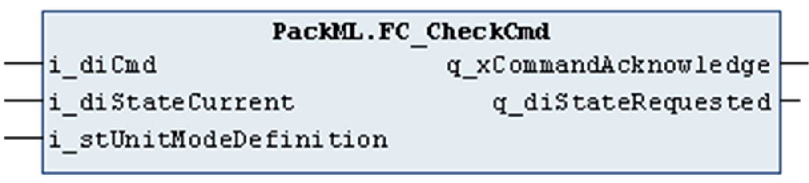

# FC\_CheckCmd

## Overview

|  |  |
| --- | --- |
| Type: | Function |
| Available as of: | V1.0.4.0 |

## Functional Description

The function FC\_CheckCmd is used to verify the plausibility of a state transition command (i\_diCmd) in the present state (i\_diStateCurrent) of the machine. The plausibility verification is performed based on the unit mode definition (i\_stUnitModeDefinition), which is provided in an array of type ST\_UnitModeDefinition. It is assumed that the unit mode definition has been validated (and deemed correct) by the function block FB\_ModeManager.

If the command is deemed as plausible, the output q\_xCommandAcknowledge indicates TRUE and the target state is provided on the output q\_diStateRequested.

FC\_CheckCmd supports the PackML base state model as defined in ANSI/ISA TR88.00.02-2015.

The following table indicates which commands are supported in which state and what is the resulting target state, which was derived from the respective unit state definition.

| Initial state | Transition command | Target state |
| --- | --- | --- |
| - | Undefined | Undefined, the output q\_xCommandAcknowledge is FALSE. |
| Execute | Reset | Resetting if Complete and Completing do not exist. |
| Complete | Reset | Resetting, or  Starting, if Resetting does not exist, or  Execute, if Resetting and Starting does not exist. |
| Stopped |
| Idle | Start | Starting, or  Execute, if Starting does not exist. |
| Stopped | Start (command is only processed if Idle does not exist) | Starting, or Execute, if Starting does not exist. |
| Any state except Aborted, Aborting, Clearing, Stopping, and Stopped | Stop | Stopping, or  Stopped, if Stopping does not exist. |
| Execute | Hold | Holding, or  Held if Holding does not exist. |
| Held | UnHold | Un-Holding, or  Execute if Un-Holding does not exist. |
| Execute | Suspend | Suspending, or  Suspended if Suspending does not exist. |
| Suspended | UnSuspend | Un-Suspending, or  Execute if Un-Suspending does not exist. |
| Any state except Aborted and Aborting | Abort | Aborting, or  Aborted if Aborting does not exist. |
| Aborted | Clear | Clearing, or  Stopped if Clearing does not exist. |

## Interface

| Inputs | Data type | Description |
| --- | --- | --- |
| i\_diCmd | DINT | The state transition command; the PackTag ST\_Command.CntrlCmd should be applied to the input. |
| i\_diStateCurrent | DINT | Machine present state; the PackTag ST\_Status.StateCurrent should be applied to the input. |
| i\_stUnitModeDefinition | ST\_UnitModeDefinition | The operation mode definition of the present operation mode; the PackTag ST\_Status.UnitModeCurrent should be used as index variable of array of ST\_UnitModeDefinition. |

| Output | Data type | Description |
| --- | --- | --- |
| q\_xCommandAcknowledge | BOOL | Indicates TRUE if the given command is plausible. |
| q\_diStateRequested | DINT | Provides the target state if the given command is plausible. |

EIO0000002809.03