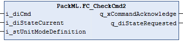

# FC\_CheckCmd2

## Overview

|  |  |
| --- | --- |
| Type: | Function |
| Available as of: | V1.4.2.0 |

## Functional Description

The FC\_CheckCmd2 function is a further development of the FC\_CheckCmd function.

Compared to the FC\_CheckCmd function, the FC\_CheckCmd2 supports the PackML base state model as defined in ANSI/ISA TR88.00.02-2022.

For the functional description and the documentation of the interface, refer to function [FC\_CheckCmd](D-SE-0077967.html).

The following table indicates the commands supported in each state and what is the resulting target state which is derived from the respective unit state definition.

| Initial state | Transition command | Target state |
| --- | --- | --- |
| Any state, or Undefined | Undefined | Undefined, the output q\_xCommandAcknowledge is FALSE. |
| Stopped or Complete | Reset | Resetting, or Idle if Resetting does not exist. |
| Stopped or Idle | Start | Command Start in state Stopped is supported only if Idle does not exist.  Starting, or Execute if Starting does not exist. |
| Execute or Suspended | Hold | Holding, or Held if Holding does not exist. |
| Execute | Suspend | Suspending, or Suspended if Suspending does not exist. |
| Execute, Held or Suspended | Complete | Completing, or Completed if Completing does not exist. |
| Any state except Aborting, Aborted, Clearing, Stopping, and Stopped | Stop | Stopping, or Stopped if Stopping does not exist. |
| Any state except Aborting or Aborted | Abort | Aborting, or Aborted if Aborting does not exist. |
| Aborted | Clear | Clearing, or Stopped if Clearing does not exist. |

EIO0000002809.03