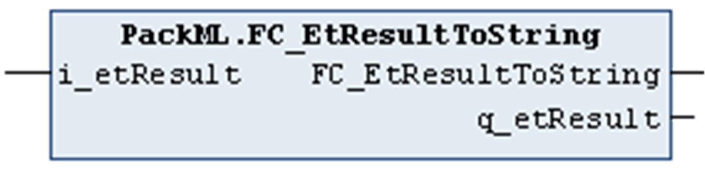

# FC\_EtResultToString

## Overview

|  |  |
| --- | --- |
| Type: | Function |
| Available as of: | V1.0.1.0 |

## Task

Convert an enumeration element of type ET\_Result to a string value.

## Functional Description

Using the function FC\_EtResultToString, you can convert an enumeration element of type ET\_Result to a string value.

## Interface

| Input | Data type | Description |
| --- | --- | --- |
| i\_etResult | ET\_Result | Enumeration with the result. |

| Output | Data type | Description |
| --- | --- | --- |
| q\_etResult | ET\_Result | Enumeration with the result. |

## Return Value

| Data type | Description |
| --- | --- |
| STRING(80) | The ET\_Result converted to a string value. |

EIO0000002809.03