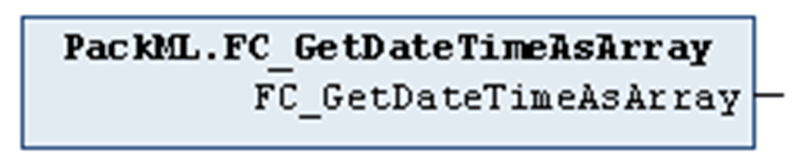

# FC\_GetDateTimeAsArray

## Overview

|  |  |
| --- | --- |
| Type: | Function |
| Available as of: | V1.1.0.0 |

## Functional Description

The function FC\_GetDateTimeAsArray is used to obtain the RTC of the controller and to convert it to the data type DateTimeArray.

The return value of the function is of type DateTimeArray and represents the value of the RTC of the controller.

EIO0000002809.03