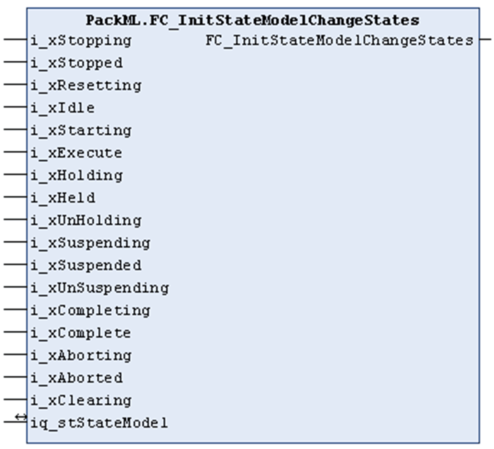

# FC\_InitStateModelChangeStates

## Overview

|  |  |
| --- | --- |
| Type: | Function |
| Available as of: | V1.0.1.0 |

## Task

Use the function FC\_InitStateModelChangeStates to define, for an operation mode, from which state a change of operation mode is possible.

## Functional Description

Using the input/output iq\_stStateModel, a structure of type ST\_UnitModeDefinition is passed to the function.

Use the 17 inputs of type BOOL, which reflect the states of an operation mode, to define from which states a change of operation mode is possible.

TRUE indicates that a change of operation mode is possible; FALSE indicates that a change of operation mode must not be attempted from this state.

Following successful initialization of the operation mode, the function provides a TRUE.

## Interface

| Input | Data type | Description |
| --- | --- | --- |
| i\_xStopping | BOOL | If this input is set to TRUE, the Stopping state is allowed to change the operation mode. |
| i\_xStopped | BOOL | If this input is set to TRUE, the Stopped state is allowed to change the operation mode. |
| i\_xResetting | BOOL | If this input is set to TRUE, the Resetting state is allowed to change the operation mode. |
| i\_xIdle | BOOL | If this input is set to TRUE, the Idle state is allowed to change the operation mode. |
| i\_xStarting | BOOL | If this input is set to TRUE, the Starting state is allowed to change the operation mode. |
| i\_xExecute | BOOL | If this input is set to TRUE, the Execute state is allowed to change the operation mode. |
| i\_xHolding | BOOL | If this input is set to TRUE, the Holding state is allowed to change the operation mode. |
| i\_xHeld | BOOL | If this input is set to TRUE, the Held state is allowed to change the operation mode. |
| i\_xUnHolding | BOOL | If this input is set to TRUE, the Un-Holding state is allowed to change the operation mode. |
| i\_xSuspending | BOOL | If this input is set to TRUE, the Suspending state is allowed to change the operation mode. |
| i\_xSuspended | BOOL | If this input is set to TRUE, the Suspended state is allowed to change the operation mode. |
| i\_xUnSuspending | BOOL | If this input is set to TRUE, the Un-Suspending state is allowed to change the operation mode. |
| i\_xCompleting | BOOL | If this input is set to TRUE, the Completing state is allowed to change the operation mode. |
| i\_xComplete | BOOL | If this input is set to TRUE, the Complete state is allowed to change the operation mode. |
| i\_xAborting | BOOL | If this input is set to TRUE, the Aborting state is allowed to change the operation mode. |
| i\_xAborted | BOOL | If this input is set to TRUE, the Aborted state is allowed to change the operation mode. |
| i\_xClearing | BOOL | If this input is set to TRUE, the Clearing state is allowed to change the operation mode. |

| Input / output | Data type | Description |
| --- | --- | --- |
| iq\_stStateModel | ST\_UnitModeDefinition | This structure reflects the operation mode which is to be initialized. |

## Return Value

| Data type | Description |
| --- | --- |
| BOOL | TRUE if initialization of the operation mode was successful. |

EIO0000002809.03