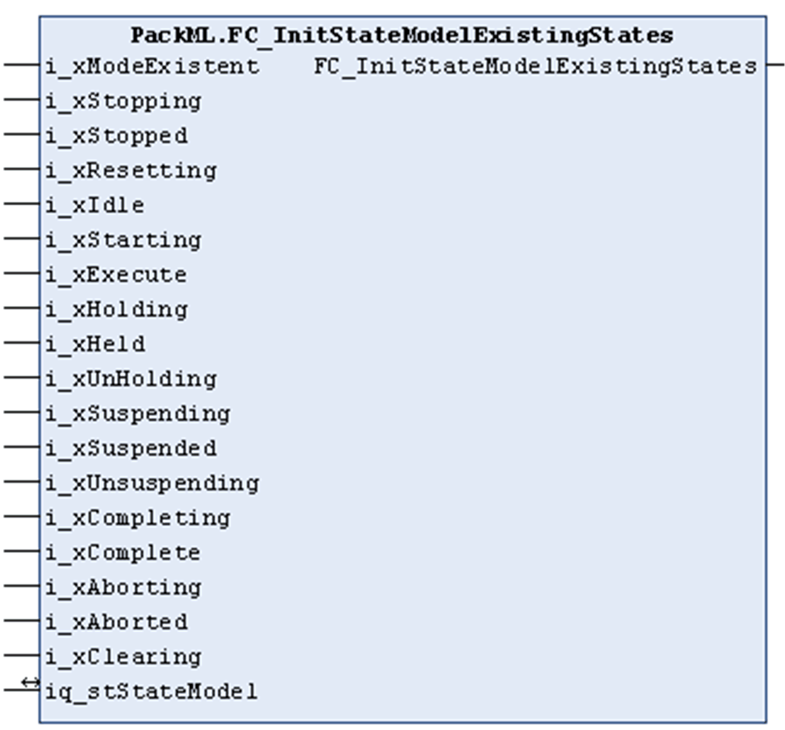

# FC\_InitStateModelExistingStates

## Overview

|  |  |
| --- | --- |
| Type: | Function |
| Available as of: | V1.0.1.0 |

## Task

Use the FC\_InitStateModelExistingStates function to initialize the state model and define an operation mode. By presenting TRUE or FALSE at the inputs, you are selecting those states to be part of your state model.

## Functional Description

Using the input/output iq\_stStateModel, a structure of type ST\_UnitModeDefinition is passed to the function.

This structure reflects an operation mode. Using the 18 inputs of type BOOL which reflect the existence of an operation mode and its states, it is possible to define which states make up the relevant operation mode.

TRUE signifies that the state exists; FALSE signifies that the state does not exist.

Following successful initialization of the operation mode, the function provides a TRUE.

## Interface

| Input | Data type | Description |
| --- | --- | --- |
| i\_xModeExistent | BOOL | If this input is set to TRUE, the operation mode is available. |
| i\_xStopping | BOOL | If this input is set to TRUE, the Stopping state is available. |
| i\_xStopped | BOOL | If this input is set to TRUE, the Stopped state is available. |
| i\_xResetting | BOOL | If this input is set to TRUE, the Resetting state is available. |
| i\_xIdle | BOOL | If this input is set to TRUE, the Idle state is available. |
| i\_xStarting | BOOL | If this input is set to TRUE, the Starting state is available. |
| i\_xExecute | BOOL | If this input is set to TRUE, the Execute state is available. |
| i\_xHolding | BOOL | If this input is set to TRUE, the Holding state is available. |
| i\_xHeld | BOOL | If this input is set to TRUE, the Held state is available. |
| i\_xUnHolding | BOOL | If this input is set to TRUE, the Un-Holding state is available. |
| i\_xSuspending | BOOL | If this input is set to TRUE, the Suspending state is available. |
| i\_xSuspended | BOOL | If this input is set to TRUE, the Suspended state is available. |
| i\_xUnSuspending | BOOL | If this input is set to TRUE, the Un-Suspending state is available. |
| i\_xCompleting | BOOL | If this input is set to TRUE, the Completing state is available. |
| i\_xComplete | BOOL | If this input is set to TRUE, the Complete state is available. |
| i\_xAborting | BOOL | If this input is set to TRUE, the Aborting state is available. |
| i\_xAborted | BOOL | If this input is set to TRUE, the Aborted state is available. |
| i\_xClearing | BOOL | If this input is set to TRUE, the Clearing state is available. |

| Input / output | Data type | Description |
| --- | --- | --- |
| iq\_stStateModel | ST\_UnitModeDefinition | This structure reflects the operation mode which is to be initialized. |

## Return Value

| Data type | Description |
| --- | --- |
| BOOL | TRUE if initialization of the operation mode was successful. |

EIO0000002809.03