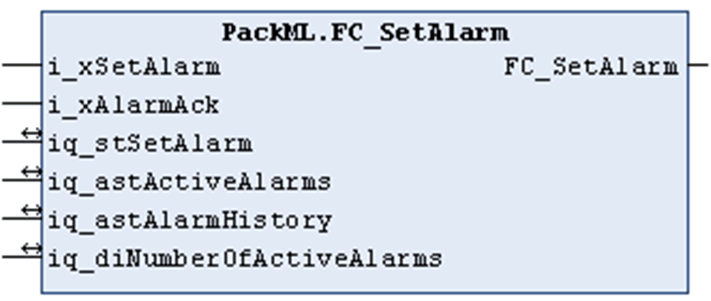

# FC\_SetAlarm

## Overview

|  |  |
| --- | --- |
| Type: | Function |
| Available as of: | V1.0.1.0 |

## Functional Description

The function FC\_SetAlarm is an auxiliary function to write alarm messages into the appropriate administration tag and also delete them again from the same. An alarm is identified exclusively by its unique identifier and the associated value. The identifier and its value are specified by the input/output parameter iq\_stSetAlarm which corresponds with the input/output parameter iq\_astAlarms[#].

This function cannot be used simultaneously in several tasks.

Through the input iq\_stSetAlarm, a machine-specific alarm message can be passed to the function.

Through the input/output parameter iq\_astAlarms, the administration tag Admin.Alarm[#] must be passed to the function. It represents the list of active alarms in the machine unit in chronological order starting with the first occurred and still active alarm.

Through the input/output parameter iq\_stAlarmHistory, the administration tag Admin.AlarmHistory[#] must be passed to the function. It represents the alarm history of the machine unit containing the alarms in chronological order starting with the last reset alarm.

If the function is called with input i\_xSetAlarm = TRUE, the function verifies whether the specified alarm message is already in the list of active alarms. If not, the function obtains the RTC of the controller and writes it together with the specified alarm message into the list of active alarms. If the maximum number of messages in the list is reached, no new message is added.

If the function is called with i\_xSetAlarm = FALSE, the specified alarm message is removed from the list of active alarms. Then it is written at the first position of the alarm history while the existing entries are moved one position down in the list. If the list is full, the oldest reset alarm is removed.

If the function is called with inputs i\_xAckAlarm and i\_xSetAlarm = TRUE, the function obtains the RTC of the controller and updates the parameter (tag) AckDateTime for the specified alarm message in the list of active alarms. If an alarm has been acknowledged once, a new request to acknowledge has no effect.

The return value of the function indicates TRUE if the specified alarm has been either written into the list or deleted from the list, or has been set to acknowledged. If the function returns FALSE, either no action was requested or the maximum number of messages in the list is reached.

## Interface

| Input | Data type | Description |
| --- | --- | --- |
| i\_xSetAlarm | BOOL | * TRUE: the reason code or machine-specific alarm message passed to the input/output iq\_stSetAlarm is written into the tag at the input/output iq\_stActiveAlarm. * FALSE: the message is deleted from iq\_stActiveAlarms and entered iq\_stAlarmHistory. |
| i\_xAlarmAck | BOOL | TRUE: the message has been detected. The appropriate time stamp for Admin.Alarm[#].TimeAck is determined. |

| Input/Output | Data type | Description |
| --- | --- | --- |
| iq\_stSetAlarm | ST\_InitAlarm | Reason code or machine-specific alarm message is passed to this input/output. |
| iq\_astActiveAlarms | ARRAY [1..Gc\_uiMaxNumberOfAlarms] OF  ST\_Alarm | The administration tag Admin.Alarm[#] should be applied to this input/output. |
| iq\_astAlarmHistory | ARRAY [1..Gc\_uiNumberOfAlarmHistory] OF  ST\_Alarm | The administration tag Admin.AlarmHistory[#] should be applied to this input/output: |
| iq\_diNumberOfActiveAlarms | DINT | Provides the number of active alarm messages. |

EIO0000002809.03