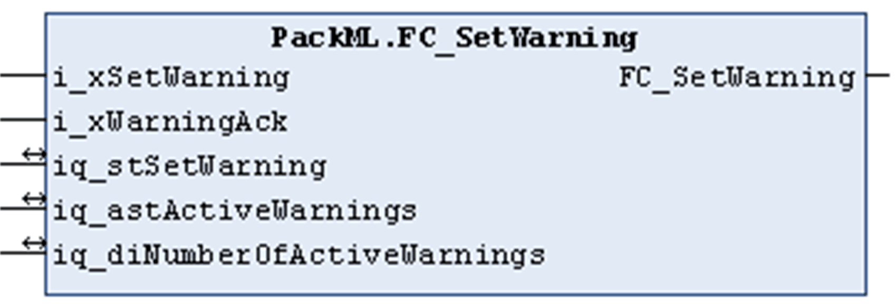

# FC\_SetWarning

## Overview

|  |  |
| --- | --- |
| Type: | Function |
| Available as of: | V1.1.0.0 |

## Functional Description

The function FC\_SetWarning is an auxiliary function to write advisory messages into the appropriate administration tag and also delete them again from the same. An advisory is identified exclusively by its unique identifier and the associated value. The identifier and its value are specified by the input/output parameter iq\_stSetWarning which corresponds with the input/output parameter iq\_astWarnings[#].

This function cannot be used simultaneously in several tasks.

Through the input iq\_stSetWarning, a machine-specific advisory message can be passed to the function.

Through the input/output parameter iq\_astWarnings, the administration tag Admin.Warning[#] must be passed to the function. It represents the list of active advisories in the machine unit in chronological order starting with the first occurred and still active advisory.

If the function is called with input i\_xSetWarning = TRUE, the function verifies whether the specified advisory message is already in the list of active advisories. If not, the function obtains the RTC of the controller and writes it together with the specified advisory message into the list of active advisories. If the maximum number of messages in the list is reached, no new messages are added.

If the function is called with i\_xSetWarning = FALSE, the specified advisory message is removed from the list of active advisories.

If the function is called with inputs i\_xAckWarning and i\_xSetWarning = TRUE, the function obtains the RTC of the controller and updates the parameter (tag) AckDateTime for the specified advisory message in the list of active advisories. If an advisory has been acknowledged once, a new request to acknowledge has no effect.

The return value of the function indicates TRUE if the specified advisory has been either written into the list or deleted from the list, or has been set to acknowledged. If the function returns FALSE, either no action was requested or the maximum number of messages in the list is reached.

## Interface

| Input | Data type | Description |
| --- | --- | --- |
| i\_xSetWarning | BOOL | Request to write (TRUE) or remove (FALSE) the specified message into/from the list linked to iq\_astWarnings. |
| i\_xWarningAck | BOOL | Request to acknowledge an active advisory. |

| Input/Output | Data type | Description |
| --- | --- | --- |
| iq\_stSetWarning | ST\_InitAlarm | Specifies the advisory message to be treated by the function. |
| iq\_astWarnings | ARRAY [1..Gc\_uiMaxNumberOfWarnings] OF ST\_Alarm | The administration tag Admin.Warning[#] must be linked to this input/output. |
| iq\_diNumberOfActiveWarnings | DINT | Provides the number of advisories in the list. |

EIO0000002809.03