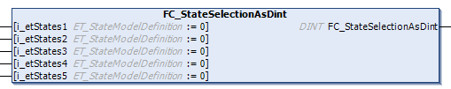

# FC\_StateSelectionAsDint

## Overview

|  |  |
| --- | --- |
| Type: | Function |
| Available as of: | V1.4.7.0 |

## Functional Description

The FC\_StateSelectionAsDint function is a utility function for definition of the PackTags StatesDisabled and StatesModeChangeAllowed that allows you to assign the corresponding parameter to the method [DefineUnitMode of the FB\_UnitModeManager2](TPC_PackMLli_FB_UniMdMng2_DefineUnitMode.html). The states can be configured by using the input of the function of type ET\_StateModelDefinition.

The inputs of type [ET\_StateModelDefinition](TPC_PackMLli_ET_StateModelDefinition.html) are combined using the OR expression to the return value of type DINT.

EIO0000002809.03