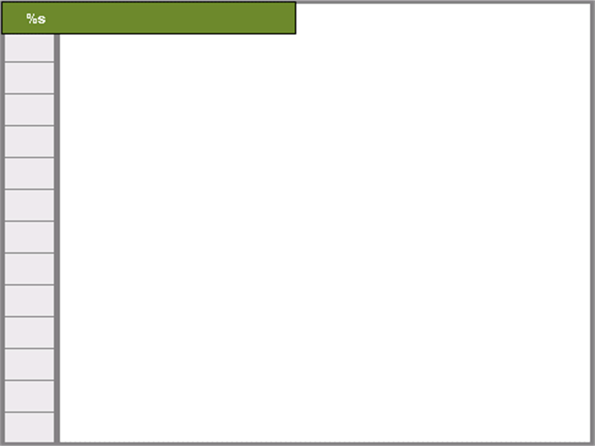
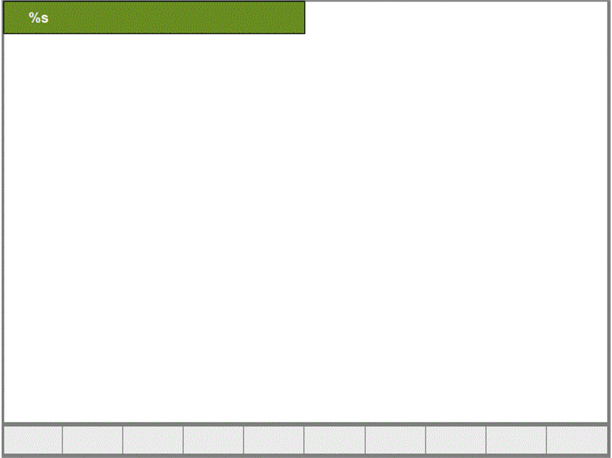

# FR\_<BackgroundFrame>

## Overview

|  |  |
| --- | --- |
| Type: | Visualization frame |
| Available as of: | V1.0.1.0 |
| Implements: | VisuElems.IVisualization |

## Task

Display a frame in the background.

## Functional Description

The FR\_<BackgroundFrame> visualization frames (for example, FR\_Control1024x768) are frames in the background to group the other frames, and to realize control and navigation functionalities. See examples below.

The following background frames are available:

| Frame | Description |
| --- | --- |
| FR\_Control1024x768 | Control frame, size 1024x768 pixels |
| FR\_Nav1024x768 | Navigation frame, size 1024x768 pixels |
| FR\_NavControl1024x768 | Navigation and control frame, size 1024x768 pixels |
| FR\_Control800x600 | Control frame, size 800x600 pixels |
| FR\_Nav800x600 | Navigation frame, size 800x600 pixels |
| FR\_NavControl800x600 | Navigation and control frame, size 800x600 pixels |

## Interface

| Input | Data type | Description |
| --- | --- | --- |
| i\_sTitle | STRING(80) | Title of the background frame |

## Examples

FR\_Control1024x768 with controls on the left side

FR\_Nav1024x768 with navigation buttons at the bottom

EIO0000002809.03