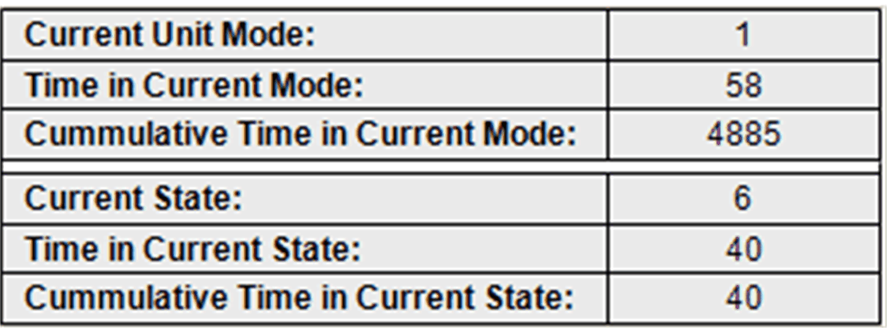

# FR\_CurrentModeAndStateTime

## Overview

|  |  |
| --- | --- |
| Type: | Visualization frame |
| Available as of: | V1.0.1.0 |
| Implements: | VisuElems.IVisualization |

## Task

Display the time the machine has been running in the present operation mode/state.

## Functional Description

FR\_CurrentModeAndStateTime is a visualization frame to display the time the machine has been running in the present operation mode (Admin.ModeCurrentTime[#] & Admin.ModeCumulativeTime[#]) and state (Admin.StateCurrentTime[#,#] & Admin.StateCumulativeTime[#,#]). See example below.

## Interface

| Input / output | Data type | Description |
| --- | --- | --- |
| iq\_stVisInterface | ST\_VisInterface | Interface to the FB\_VisController |

## Example

NOTE: This example only demonstrates the PackTag information, which, according to the standards, is presented as seconds.

EIO0000002809.03