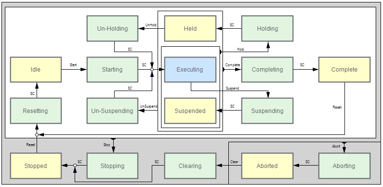

# FR\_PackMLStateModel\_2022\_Base

## Overview

|  |  |
| --- | --- |
| Type: | Visualization frame |
| Available as of: | V1.4.7.0 |

## Task

Dynamically display the visualization of the state model and the present state.

## Functional Description

The FR\_PackMLStateModel\_2022\_Base dynamically displays the state model and the present state. The state model is compliant to the PackML base state model as defined in ANSI/ISA TR88.00.02-2022.

## Interface

| Input / output | Data type | Description |
| --- | --- | --- |
| iq\_diStateCurrent | DINT | Indicates the present state. |
| iq\_dwStatesDisabled | DWORD | Indicates the definition of the state model. |

## Example

The displayed state model is dynamically adapted based on the state model defined.

EIO0000002809.03