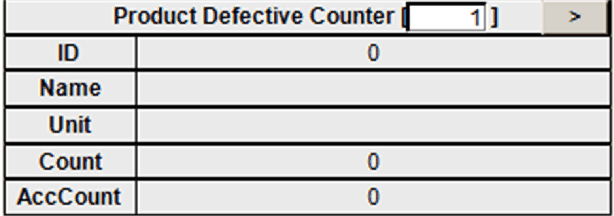

# FR\_ProdDefectiveCount

## Overview

|  |  |
| --- | --- |
| Type: | Visualization frame |
| Available as of: | V1.0.1.0 |
| Implements: | VisuElems.IVisualization |

## Task

Display the product counters of the goods detected as not acceptable.

## Functional Description

FR\_ProdDefectiveCount is a visualization frame to display the product counters of the goods detected as not acceptable (Admin.ProdDefectiveCount[#])

## Interface

| Input / output | Data type | Description |
| --- | --- | --- |
| iq\_stVisInterface | ST\_VisInterface | Interface to the FB\_VisController |

## Example

EIO0000002809.03