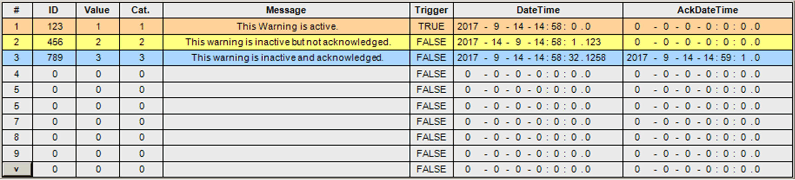

# FR\_Warning

## Overview

|  |  |
| --- | --- |
| Type: | Visualization frame |
| Available as of: | V1.1.0.0 |
| Implements: | VisuElems.IVisualization |

## Task

Display a list of the active advisories.

## Functional Description

FR\_Warning is a visualization frame to display the list of the active advisories (Admin.Warning[#]). See example below.

## Interface

| Input / output | Data type | Description |
| --- | --- | --- |
| iq\_stVisInterface | ST\_VisInterface | Interface to the FB\_VisController |

## Example

EIO0000002809.03