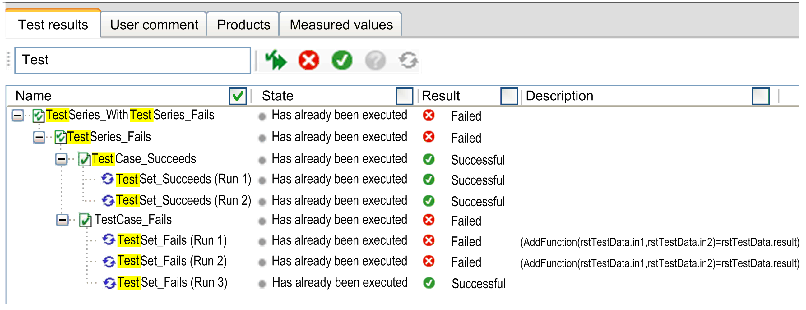

# Evaluate Test Results

## Overview

The ETEST framework provides the test results of a completed test and shows the progress of a running test in the Test results view.

NOTE: If test cases are built for function blocks contained in libraries, verify the compatibility of any library updates as it concerns your test cases.

## Executed Tests

The Tests runs list contains the tests that have been executed since Logic Builder has been started.

| Buttons | Description |
| --- | --- |
| Export | Stores selected test results in XML format. (*\*.testresult*). |
| Import | Opens test results stored in XML format. |
| Print report | Opens an HTML report in the web browser. |

## Test Results

Click an entry in the Tests runs list to open the test in the area Test results.

Imported test results are also opened in the area Test results and shown in the list of the most recently executed tests. The area Test results is automatically opened when a test is started. It shows the result (or the state) of a test.

The area Test results provides two sections.

* At the top, there is the summary of the test results that contains the name of the executed POU and the total result.
* Below, there is a section with various tabs:

| Tab | Description |
| --- | --- |
| Test results | Tree view which shows the test series and test cases.  It displays the individual results for each node. |
| User comment | User name and comment.  Shows by default the Windows user name.  You can add a comment to the Comment box. This data is stored together with the test result. |
| Products | Lists the libraries available in the project during the test. |
| Measured values | Lists measured values that were recorded during the execution of the test. Used to measure time values and the size of data structures. |

## Filter

You can filter the entries by a string and the selected column. By default, the Name column is selected.

A selected part of the found string (in this example, Test) is marked yellow. The list shows the marked entries and its parent nodes.

## Test Specific Commands

| Command | Description |
| --- | --- |
| Run All Tests | Runs the tests that appear in the list. |
| Run Selected Tests | Runs the selected tests of the list. |
| Cancel test run | Cancels a running test. |
| Run Failed Tests | Runs the tests of the list that are indicated as unsuccessful. |
| Run Passed Tests | Runs the tests of the list that are indicated as successful. |
| Run Not Run Tests | Runs the not-executed tests of a last test run that was previously canceled. |
| Repeat Last Run | Repeats a test run that was executed previously from the result view. |

EIO0000002884.01

© 2021

Schneider Electric.

All rights reserved.