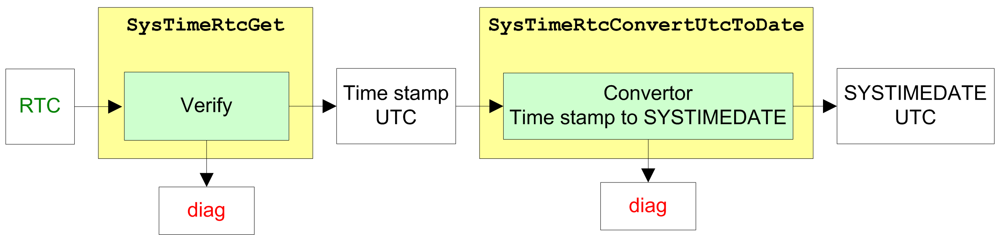
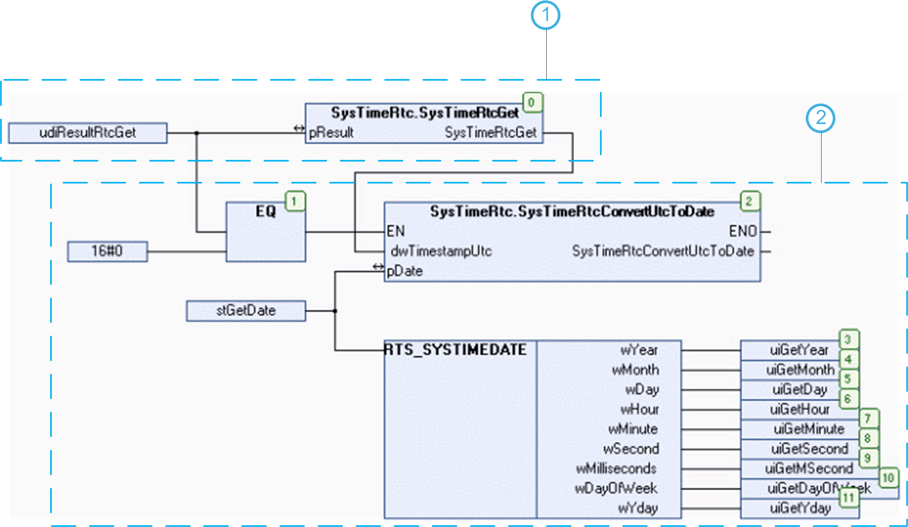

# Get the Controller Date and Time

## Overview

To get the RTC of the controller in a structured and ergonomic format, you have to use 2 different functions.

1. Read the RTC, using the functions [SysTimeRtcGet](D-SE-0005794.html#D-SE-0005794) or [SysTimeRtcHighResGet](D-SE-0066903.html#D-SE-0066903).
2. Convert the time stamp in UNIX format to the SYSTIMEDATE format with the use of the function [SysTimeRtcConvertUtcToDate](D-SE-0005793.html#D-SE-0005793) or [SysTimeRtcConvertHighResToDate](D-SE-0066902.html#D-SE-0066902).

NOTE: Due to the fact that only the UTC (Coordinated Universal Time) time is globally unique, on most systems only the UTC time is stored and processed.

## Principle Diagram - Get the RTC of the Controller

NOTE: Getting the RTC is also possible in high resolution, using in place HighRes function blocks.

## Example

This program example can be used to get the controller date and time.

**Variable declaration:**

`VAR`

`uidResultRtcGet: UDINT;`

`stGetDate: SysTimeRtc.RTS_SYSTIMEDATE;`

`uiGetYear: UINT;`

`uiGetMonth: UINT;`

`uiGetDay: UINT;`

`uiGetHour: UINT;`

`uiGetMinute: UINT;`

`uiGetSecond: UINT;`

`uiGetMSecond: UINT;`

`uiGetDayOfWeek: UINT;`

`uiGetYday: UINT;`

`uidResultConvertToDate: UDINT;`

`END_VAR`

**POU program:**

**1** Get the RTC of the controller as time stamp value.

**2** Convert the time stamp value in SYSTIMEDATE format.

EIO0000002944.03