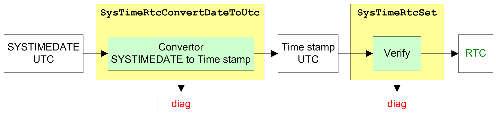
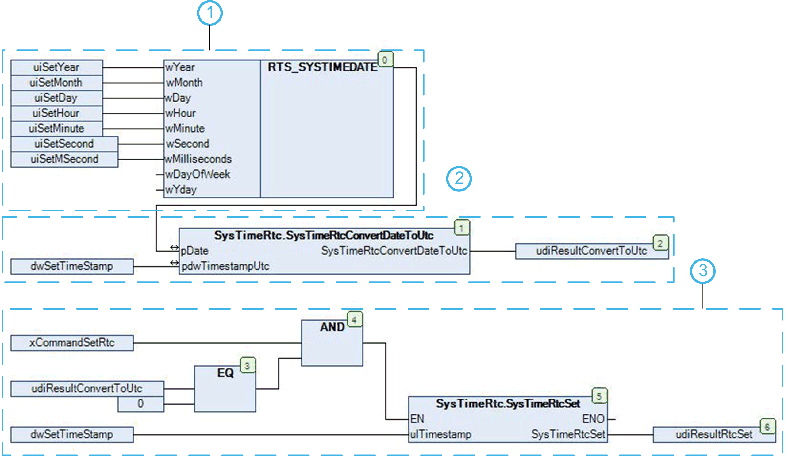

# Set the Controller Date and Time

## Overview

To set the RTC of the controller based on a structured and ergonomic format, you have to use 2 different functions.

1. Convert the SYSTIMEDATE format to the time stamp in UNIX format with the use of the function [SysTimeRtcConvertDateToUtc](D-SE-0005791.html#D-SE-0005791) or [SysTimeRtcConvertDateToHighRes](D-SE-0066901.html#D-SE-0066901).
2. Write the RTC, using the functions [SysTimeRtcSet](D-SE-0005795.html#D-SE-0005795) or [SysTimeRtcHighResSet](D-SE-0066904.html#D-SE-0066904).

NOTE: Some controllers support a function for a weekly automatic correction of the real time clock. The name of this function is SetRTCDrift. The use of this function could be an alternative to using the SysTimeRtcSet function for the continuously readjustment of the RTC. Refer to the [PLCSystem Library Guide](D-SE-0084196.1.html#D-SE-0084196.1__D-SE-0084196.11) of your controller to verify whether the function is supported and to get further information about this function.

NOTE: Due to the fact that only the UTC (Coordinated Universal Time) time is globally unique, on most systems only the UTC time is stored and processed.

## Principle Diagram - Set the RTC of the Controller

NOTE: Setting the RTC is also possible in high resolution, using in place HighRes function blocks.

## Example

This program example can be used to set the controller real time clock with a user date and time.

**Variable declaration:**

`VAR`

`uiSetYear: UINT;`

`uiSetMonth: UINT;`

`uiSetDay: UINT;`

`uiSetHour: UINT;`

`uiSetMinute: UINT;`

`uiSetSecond: UINT;`

`uiSetMSecond: UINT;`

`udiResultConvertToUtc: UDINT;`

`dwSetTimeStamp: DWORD;`

`xCommandSetRtc: BOOL;`

`uidResultRtcSet: UDINT;`

`END_VAR`

**POU program:**

**1** Assign the date and time parameter to the structure.

**2** Convert the SYSTIMEDATE format to a time stamp value.

**3** Set the controller RTC with new time stamp if `xCommandSetRtc` = TRUE and conversion was successful.

EIO0000002944.03