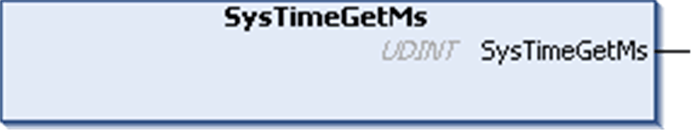

# SysTimeGetMs

## Function Description

Returns a monotonic rising millisecond counter. This value can be used for timeout and relative time measurements. The counter is reset at each restart of the controller.

NOTE: The real time clock does not influence this counter.

## Graphical Representation

## I/O Variables Description

| Output | Type | Description |
| --- | --- | --- |
| SysTimeGetMs | UDINT | Value of the millisecond counter, which is reset at each restart. |

EIO0000002944.03