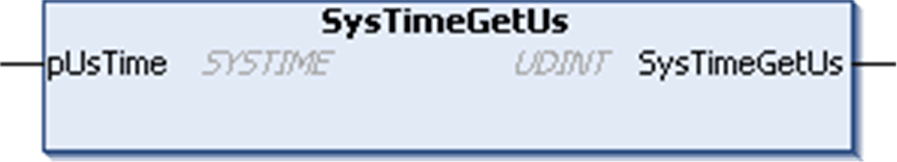

# SysTimeGetUs

## Function Description

Returns a monotonic rising microsecond counter. This value can be used for timeout and high resolution time measurements.

The counter is reset at each restart of the controller.

NOTE: The real time clock does not influence this counter.

## Graphical Representation

## I/O Variables Description

| Output | Type | Description |
| --- | --- | --- |
| SysTimeGetUs | UDINT | Runtime system error code (refer to CmpErrors.library):  0 = no error detected |

| Input/Output | Type | Description |
| --- | --- | --- |
| pUsTime | SYSTIME | Value of the microsecond counter, which is reset at each controller restart. |

NOTE: SYSTIME is an alias type based on the data type ULINT.

EIO0000002944.03