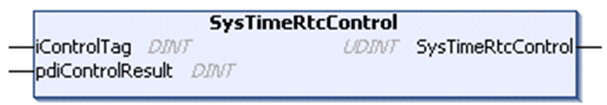

# SysTimeRtcControl

## Function Description

This function is used to read the hardware status information related to the real time clock (RTC).

This function is not available for all controllers. Consult the *Programming Guide* specific to your controller for further information.

## Graphical Representation

## I/O Variables Description

| Input | Type | Description |
| --- | --- | --- |
| iControlTag | DINT | 0 = to verify the battery of the RTC  1 = to verify the hour format of the RTC |

| Input/Output | Type | Description |
| --- | --- | --- |
| pdiControlResult | DINT | Result of the verification.  Hour format verification:  0 = 12-hour format  1 = 24-hour format  Battery verification:  0 = indicates that the battery needs to be replaced  1 = battery is ok |

| Output | Type | Description |
| --- | --- | --- |
| SysTimeRtcControl | UDINT | Runtime system error code (refer to CmpErrors.library):  0 = no error detected |

EIO0000002944.03