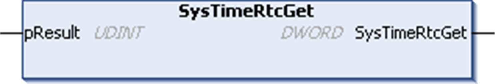

# SysTimeRtcGet

## Function Description

This function is used to read the value of the real time clock (RTC) of the controller. The RTC is provided as time stamp which indicates the number of seconds since January 1st, 1970 00:00:00.

## Graphical Representation

## I/O Variables Description

| Input/Output | Type | Description |
| --- | --- | --- |
| pResult | UDINT | Runtime system error code (refer to CmpErrors.library):  0 = no error detected |

| Output | Type | Description |
| --- | --- | --- |
| SysTimeRtcGet | DWORD | RTC of the controller (number of seconds since January 1st, 1970 00:00:00) |

NOTE: [An example using this function is provided in this document](D-SE-0005803.html#D-SE-0005803__D-SE-0005803.5).

EIO0000002944.03