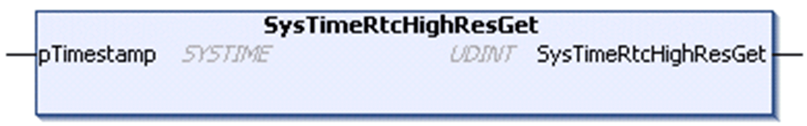

# SysTimeRtcHighResGet

## Function Description

This function is used to read the value of the real time clock (RTC) of the controller. The RTC is provided as high resolution time stamp which indicates the number of milliseconds since January 1st, 1970 00:00:00:000.

## Graphical Representation

## I/O Variables Description

| Input/Output | Type | Description |
| --- | --- | --- |
| pTimestamp | SYSTIME | Time in milliseconds since January 1st, 1970 00:00:00:000 |

| Output | Type | Description |
| --- | --- | --- |
| SysTimeRtcHighResGet | UDINT | Runtime system error code (refer to CmpErrors.library):  0 = no error detected |

NOTE: SYSTIME is an alias type based on the data type ULINT.

EIO0000002944.03