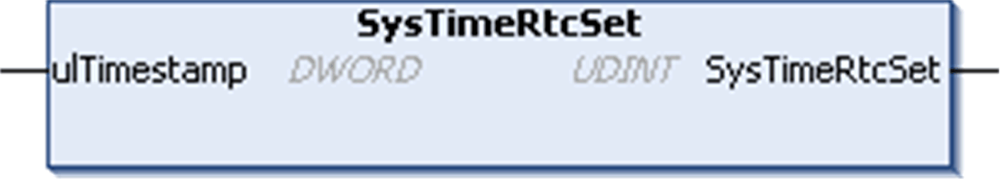

# SysTimeRtcSet

## Function Description

This function is used to set the real time clock of the controller by a provided time stamp which indicates the numbers of seconds since January 1st, 1970 00:00:00. Setting the RTC of the controller generates entries into the controller log file.

NOTE: Avoid continuous use of the SysTimeRtcSet as this can have an impact on system stability and can lead to termination of the web server connection.

## Graphical Representation

## I/O Variables Description

| Input | Type | Description |
| --- | --- | --- |
| ulTimestamp | DWORD | Time stamp value (number of seconds since January 1st, 1970 00:00:00) |

| Output | Type | Description |
| --- | --- | --- |
| SysTimeRtcSet | UDINT | Runtime system error code (refer to CmpErrors.library):  0 = no error detected |

NOTE: [An example using this function is provided in this document](D-SE-0005806.html#D-SE-0005806__D-SE-0005806.5).

EIO0000002944.03