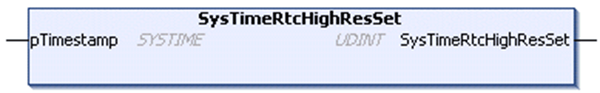

# SysTimeRtcHighResSet

## Function Description

This function is used to set the real time clock (RTC) of the controller by a provided high resolution time stamp value which indicates the number of milliseconds since January 1st, 1970 00:00:00:000.

NOTE: Setting the RTC of the controller generates entries into the controller log file. Therefore, for automatic adjustments, do not use this function more than once a day.

## Graphical Representation

## I/O Variables Description

| Input/Output | Type | Description |
| --- | --- | --- |
| pTimestamp | SYSTIME | Time stamp value (number in milliseconds since January 1st, 1970 00:00:00:000). |

| Output | Type | Description |
| --- | --- | --- |
| SysTimeRtcHighResSet | UDINT | Runtime system error code (refer to CmpErrors.library):  0 = no error detected |

EIO0000002944.03