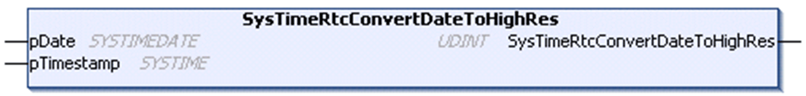

# SysTimeRtcConvertDateToHighRes

## Function Description

This function converts a date and time in [SYSTIMEDATE](D-SE-0005796.html#D-SE-0005796) format into the corresponding high resolution time stamp value. The time stamp indicates the number of milliseconds since January 1st, 1970 00:00:00:000.

## Graphical Representation

## I/O Variables Description

| Input/Output | Type | Description |
| --- | --- | --- |
| pDate | [SYSTIMEDATE](D-SE-0005796.html#D-SE-0005796) | The time to be converted. |
| pTimestamp | SYSTIME | Time stamp calculated from `pDate`. |

| Output | Type | Description |
| --- | --- | --- |
| SysTimeRtcConvertDateToHighRes | UDINT | Runtime system error code (refer to CmpErrors.library):  0 = no error detected |

NOTE: SYSTIME is an alias type based on the data type ULINT.

EIO0000002944.03