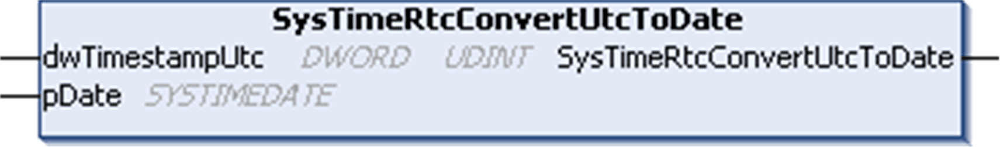

# SysTimeRtcConvertUtcToDate

## Function Description

This function converts a time stamp value into the corresponding date and time in [SYSTIMEDATE format.](D-SE-0005796.html#D-SE-0005796) The time stamp indicates the number of seconds since January 1st, 1970 00:00:00.

## Graphical Representation

## I/O Variables Description

| Input | Type | Description |
| --- | --- | --- |
| dwTimestampUtc | DWORD | Time stamp to be converted. |

| Input/Output | Type | Description |
| --- | --- | --- |
| pDate | [SYSTIMEDATE](D-SE-0005796.html#D-SE-0005796) | Date and time calculated from input value. |

| Output | Type | Description |
| --- | --- | --- |
| SysTimeRtcConvertUtcToDate | UDINT | Runtime system error code (refer to CmpErrors.library):  0 = no error detected |

NOTE: [An example using this function is provided in this document](D-SE-0005803.html#D-SE-0005803__D-SE-0005803.5).

EIO0000002944.03