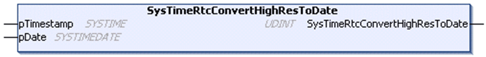

# SysTimeRtcConvertHighResToDate

## Function Description

This function converts a high resolution time stamp value into the corresponding date and time in [SYSTIMEDATE](D-SE-0005796.html#D-SE-0005796) format. The time stamp indicates the number of milliseconds since January 1st, 1970 00:00:00:000.

## Graphical Representation

## I/O Variables Description

| Input/Output | Type | Description |
| --- | --- | --- |
| pTimestamp | SYSTIME | Time stamp to be converted. |
| pDate | [SYSTIMEDATE](D-SE-0005796.html#D-SE-0005796) | Date and time calculated from the input value. |

| Output | Type | Description |
| --- | --- | --- |
| SysTimeRtcConvertHighResToDate | UDINT | Runtime system error code (refer to CmpErrors.library):  0 = no error detected |

NOTE: SYSTIME is an alias type based on the data type ULINT.

EIO0000002944.03