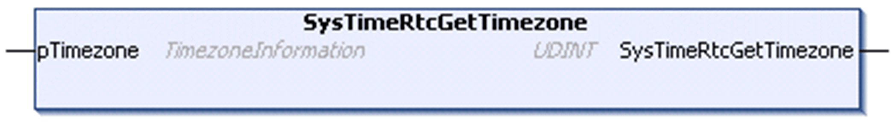

# SysTimeRtcGetTimezone

## Function Description

This function is used to read the timezone settings of the controller.

## Graphical Representation

## I/O Variables Description

| Input/Output | Type | Description |
| --- | --- | --- |
| pTimezone | [TimezoneInformation](D-SE-0067624.html#D-SE-0067624) | Timezone settings of the controller. |

| Output | Type | Description |
| --- | --- | --- |
| SysTimeRtcGetTimezone | UDINT | Runtime system error code (refer to CmpErrors.library):  0 = no error detected |

EIO0000002944.03