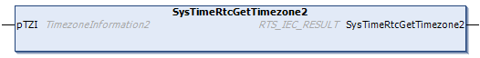

# SysTimeRtcGetTimezone2

## Function Description

This function returns the timezone information.

## Graphical Representation

## I/O Variables Description

| Input/Output | Type | Description |
| --- | --- | --- |
| pTZI | [TimezoneInformation2](TimezoneInfo2-D6791C37.html) | Pointer to the specified timezone. |

| Return value | Type | Description |
| --- | --- | --- |
| SysTimeRtcGetTimezone2 | RTS\_IEC\_RESULT | Runtime system error code (refer to CmpErrors.library):  0 = no error detected |

EIO0000002944.03