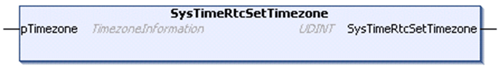

# SysTimeRtcSetTimezone

## Function Description

This function is used to set the specified timezone settings.

The timezone settings are specified using the structure TimezoneInformation and are stored in the file system of the controller.

The timezone settings are taken into account for the conversion of the UTC timestamp to local timestamp and vice versa.

The timezone settings are taken into account by the following conversion functions:

* SysTimeRtcConvertLocalToUtc
* SysTimeRtcConvertUtcToLocal
* SysTimeRtcConvertLocalToHighRes
* SysTimeRtcConvertHighResToLocal

The following parameter information is specific to PacDrive LMC controllers:

* The timezone settings are used when using the parameters [RealTimeClock](../../../../../api/crossBook?lang=en-US&virtualBookName=PD.Parameter.LMCPro&topicID=D_SE_0073273) RealTimeClock and [SetRealTimeClock](../../../../../api/crossBook?lang=en-US&virtualBookName=PD.Parameter.LMCPro&topicID=D_SE_0073272) that are provided on the PacDrive LMC controllers.
* The parameter RealTimeClock provides the local time that is calculated from the RTC of the controller and the timezone information.
* The parameter SetRealTimeClock is used to set the RTC of the controller, whereby the specified value is converted to the UTC value based on the timezone settings before the RTC is set.

NOTE: The execution of the function SysTimeRtcSetTimezone may take several hundred milliseconds. The increased execution time is caused by storing the TimezoneInformation parameter to a configuration file in the controller.

To help to avoid blocking other tasks when executing this function, implement one of the following measures:

* Use the asynchronous mechanism provided by the [AsyncManager library](../../../../../api/crossBook?lang=en-US&virtualBookName=AsyManLG&topicID=D_SE_0094746) to outsource the function call to an external task.
* Implement the function call in a separate task with suitable task configuration.

## Graphical Representation

## I/O Variables Description

| Input/Output | Type | Description |
| --- | --- | --- |
| pTimezone | [TimezoneInformation](D-SE-0067624.html#D-SE-0067624) | Timezone settings to be set for the controller. |

| Output | Type | Description |
| --- | --- | --- |
| SysTimeRtcSetTimezone | UDINT | Runtime system error code (refer to CmpErrors.library):  0 = no error detected |

EIO0000002944.03