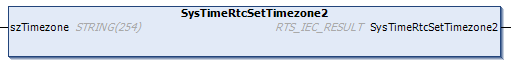

# SysTimeRtcSetTimezone2

## Function Description

This function is used to set the specified timezone settings.

NOTE: This function is available with library V3.5.21.30 and later versions. It is exclusive to [specific controllers](D-SE-0084196.1.html#D-SE-0084196.1__D-SE-0084196.2). The placeholder SysTimeRtc is resolved by the controller only if the corresponding library version is supported. If you use a function that is not supported by the controller, login is denied and an error message is displayed.

The timezone setting is specified with the input string szTimezone that conforms to the format of the POSIX 1.2024 environment variable TZ.

Example value for the input szTimezone (from POSIX 1.2024 documentation), including the appropriate daylight saving time and the dates of applicability:

`'CET-1CEDT,M3.0.0/2,M10.0.0/3'`

These values have the following effect:

Change to Central European Daylight Time at 2:00 AM on the last Sunday in March and change back at 3:00 AM on the last Sunday in October while keeping the Central European Time (CET) time offset from UTC.

szTimezone consists of the following values:

| Value | Description |
| --- | --- |
| `CET-1CEDT` | Your timezone |
| `M3` | The third month |
| `.0` | The last occurrence of the day in the month |
| `.0` | Sunday |
| `/2` | The time |

The timezone settings are taken into account for the conversion of the UTC timestamp to local timestamp and vice versa.

The timezone settings are taken into account by the following conversion functions:

* SysTimeRtcConvertLocalToUtc
* SysTimeRtcConvertUtcToLocal
* SysTimeRtcConvertLocalToHighRes
* SysTimeRtcConvertHighResToLocal

The following parameter information is specific to PacDrive LMC controllers:

* The timezone settings are used when using the parameters [RealTimeClock](../../../../../api/crossBook?lang=en-US&virtualBookName=PD.Parameter.LMCPro&topicID=D_SE_0073273) RealTimeClock and [SetRealTimeClock](../../../../../api/crossBook?lang=en-US&virtualBookName=PD.Parameter.LMCPro&topicID=D_SE_0073272) that are provided on the PacDrive LMC controllers.
* The parameter RealTimeClock provides the local time that is calculated from the RTC of the controller and the timezone information.
* The parameter SetRealTimeClock is used to set the RTC of the controller, whereby the specified value is converted to the UTC value based on the timezone settings before the RTC is set.

NOTE: The execution of the function SysTimeRtcSetTimezone may take several hundred milliseconds. The increased execution time is caused by storing the TimezoneInformation parameter to a configuration file in the controller.

## Graphical Representation

## I/O Variables Description

| Input/Output | Type | Description |
| --- | --- | --- |
| szTimezone | STRING[254] | String providing the timezone information. |

| Return value | Type | Description |
| --- | --- | --- |
| SysTimeRtcSetTimezone2 | RTS\_IEC\_RESULT | Runtime system error code (refer to CmpErrors.library):  0 = no error detected |

EIO0000002944.03